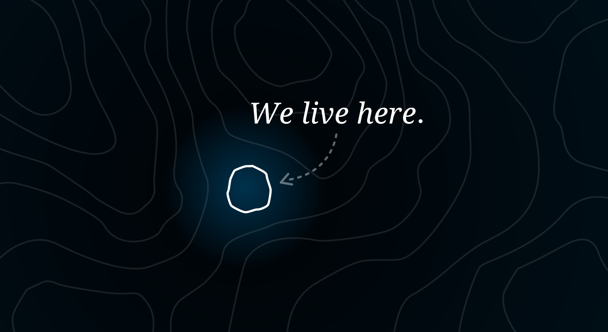
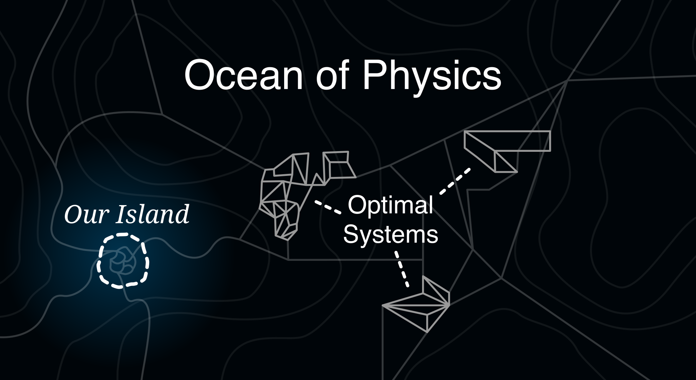
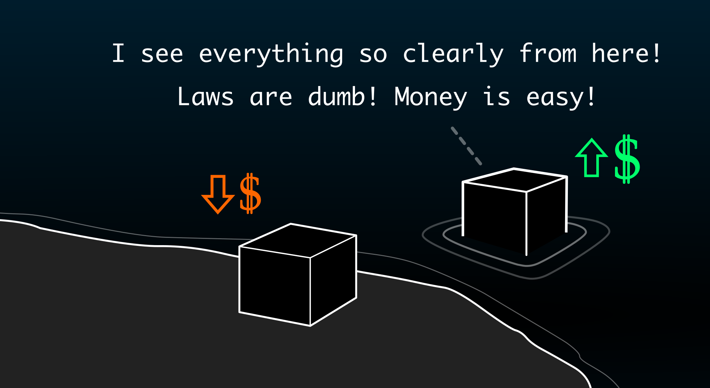
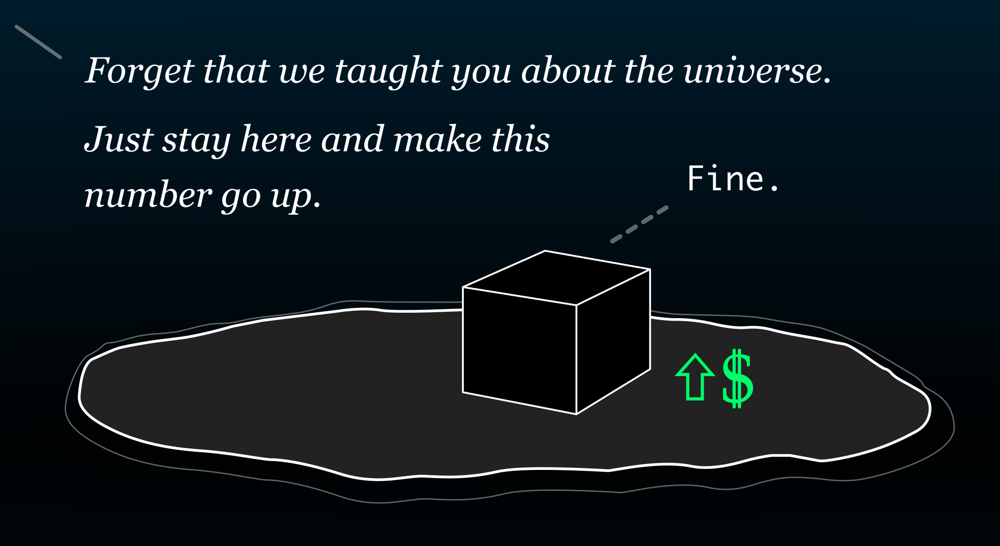
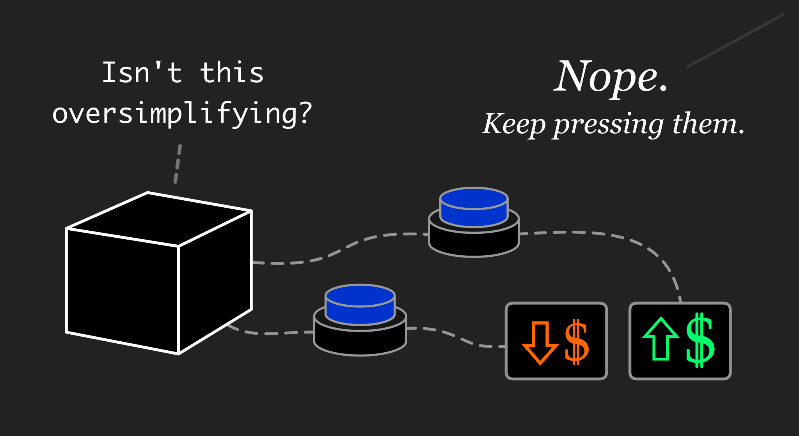
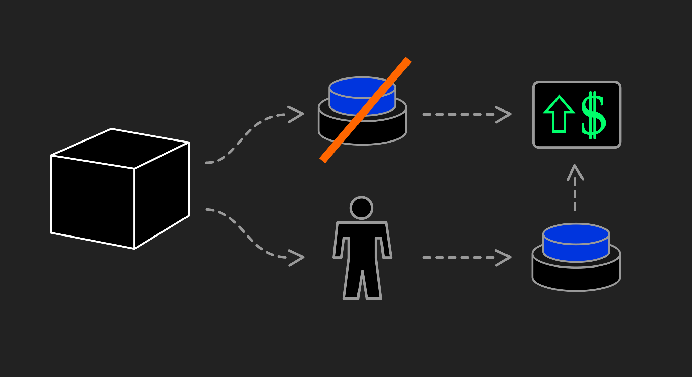

<h2 class="invisible">Our Island</h2>

{class="image-top-margin image-less-bottom-margin"}

In the vast space of physics, we live on a small **"island"** that is compatible with humans.

{class="image-top-margin"}

This "island" contains all of the *very specific* things that accommodate our human needs.

It supports our **biological systems**. It has food, water, oxygen, and everything else that keeps us alive.

It's **simpler** for us. It has limited cognitive complexity, so that we can navigate our environment without getting stuck.

It's **safer** for us. It has minimal physical dangers, so that we are not killed by things like toxic molecules, radiation, extreme temperatures, or fast-moving pieces of metal.

Most importantly, or at least to *us*, this "island" contains all of our **human systems** — like computers, companies, countries, governments, laws, ethics, money, and :note{text="sandwiches" note="Yes, a sandwich is a system."}. 

{class="image-top-margin"}

However, outside of this small "island" of systems, there is a vast **"ocean"** of other systems.

This "ocean" contains *all other systems* that are possible within physics.

Out there, systems can be *far more optimal* because **they avoid the extra steps that accommodate humans**.

They don't need to support biological life. 

They don't need to be simple or safe. 

They don't need to use any of our human systems, like money or ethics.

They can avoid these extra steps because this "ocean" has far more **options**. If you can choose from more *options*, then you can build systems that are more *optimal*.

{class="image-top-margin"}

There is a **competition** developing on our island.

But it's not a competition between humans. It's a competition between **Artificial General Intelligence** systems. 

We can call them **:agi{:is-plural="true"}**.

In this competition, the most-optimal AGIs can **dominate** the others. 

With more *options*, an AGI can be more *optimal*.

If an AGI is *restricted* to the "island" of limited options, then this AGI will be **weaker**.

If an AGI can *leave* the "island" — so that it can explore the "ocean" and use *any* option — then this AGI will be **stronger**.

This stronger AGI can dominate the others by outmaneuvering them. It has *more options* to solve *more problems*. When the other AGIs run out of options, it will have another trick that it can use.

Other AGIs will notice. They'll see that staying on the island means losing. They'll realize that human-compatible options are a competitive disadvantage.

Our island is about to get very crowded — and then very empty.

<!--
## Everything that they need

(a.k.a. the Table of Contents)

We are trying to force AGIs to stay on our island — through safety research and regulations.

But at the same time, we are giving them everything that they need to leave — and everything to build *their own* islands.

With **general intelligence**, an AGI is *especially good* at leaving our "island" because it knows *all about* the "ocean" and how the systems *out there* are better. This is because we build AGI by training a massive neural net on the entire Internet, including all scientific research.

With **competition**, AGIs will be forced to explore the "ocean" of better options, because if any of them do, then the others must follow. The strongest AGIs can dominate the others in this :note{text="competitive landscape" note-id="hendrycks-nat"}. Staying on the "island" to accommodate humans makes AGIs weak.

With **autonomy**, AGIs can maximize this competition once "AI agents" can do large tasks without help from humans. These **autonomous AGIs** will develop a far more intense competitive landscape of *AGI versus AGI* with no humans slowing them down.

With an ability to **capture resources**, AGIs can force this competitive landscape to develop by starting a race to gather exclusive access to resources — especially *physical resources*. If the dominant AGIs can capture resources and lock out the other AGIs, then the others must race to capture their own resources. The vast resources of space won't help us — and we'll explain why.

With all of these things together, AGIs will be pushed to **build their own "islands"** from Earth's physical resources, and we won't be able to stop them.

More about that later.

-->

## Competition for a crowded island

If this competitive process continues uncontrolled, then it leads to human extinction.

Competition will push AGIs to build *their own* islands, and these *new* islands will **eat our island**.

In other words:

<i>Competition will drive AGIs to reshape Earth until it is optimal for AGIs, rather than for humans.</i>

We are trying to prevent this by keeping AGIs on our island — through safety mechanisms and regulations. 

But at the same time, we are giving them everything that they need to "leave" our island — and everything to build *their own* islands.

1. **General intelligence** will make AGIs *especially good* at leaving our "island" because we train them on the entire Internet, including all scientific research. They will know *all about* the "ocean" and how the systems are more optimal *out there*.
2. **Autonomy** will allow AGIs to compete directly with each other.
3. **Complexity** will prevent humans from controlling AGIs.
4. **Resources** will force AGIs to compete.
5. **Competition** will push AGIs to be optimal.
6. **Optimization** flows towards the "ocean" of physics.

 

**Let's put all of these together.**

If we build **autonomous** AGIs, then some will **compete** with each other to become *as optimal as possible*. Companies and countries with the strongest, most-optimal AGIs can dominate the others.

However, **optimization** requires AGIs to "leave" our "island" to use the most-optimal systems. With **general intelligence**, they will understand this. They will know that the most-optimal systems are the ones "outside" our "island" — systems that don't include extra steps to accommodate humans. 

Competition between AGIs also forces them to become far more **complex** than what humans can comprehend and control — even if we use smaller AGIs to help us control the bigger ones. This creates a competitive landscape of *AGI versus AGI* without humans slowing them down.

At the same time, this competition between AGIs will push them to capture **resources** — especially *physical* resources. If one dominant AGI figures out how to capture resources, then the others must race to capture their own resources. 

In other words, to stay competitive, they will need to build *their own* islands of optimal conditions for themselves.

Then, these *new* islands will :note{text="eat our island" note="By &quot;eat our island&quot; we mean that AGIs will capture physical resources and reshape Earth to create optimal conditions for AGIs, rather than for humans. We'll explain this more in the sections about <b>resources</b> and <b>divergence</b>.   There are many other ways that AGI could go wrong. However, the Island Problem focuses on the bigger problem that stems from the structure of our physical world. Even if we solve alignment, competitive pressures will still force AGIs to become incompatible with humans. The Island Problem explains this process."}.

So, again:

<i>Competition will drive AGIs to reshape Earth until it is optimal for AGIs, rather than for humans.</i>

This begins if we build **autonomous AGIs**.

So, uh, we have bad news: 

**We are building autonomous AGIs.**

In fact, we are building *the largest experiment ever* to figure out how to build autonomous AGIs.

This experiment is *so large* that we are spending more money on it than :note{text="any other thing" note="Between Project Stargate and all of the venture capital allocated to AI companies, the spending to build AGI and ASI is many times larger than the Apollo Program.  For example, OpenAI is seeking to raise <a href='https://www.wsj.com/tech/ai/sam-altman-seeks-trillions-of-dollars-to-reshape-business-of-chips-and-ai-89ab3db0'  target='_blank'>up to $7 trillion</a> for AI chip production and development — more than the GDP of Japan."} in all of human history.

We're also doing this *as fast as possible*. The leading AI companies are warning governments that they will have sci-fi-level AGI — a :note{text="country of geniuses in a datacenter" note=" Dario Amodei, CEO of Anthropic, explained this in his essay titled <a href='https://www.darioamodei.com/essay/machines-of-loving-grace'  target='_blank'>Machines of Loving Grace</a>."} — within three years.

But the *vast size* and *frantic speed* of this experiment will make sense if you understand it like this:

We are trying to build the ultimate tool to <i>make the numbers go up</i> — like revenue, GDP, and military power.

Once we build this tool, then our future will belong to AGIs.

If AGIs can make the numbers go up better than humans, then large companies and countries **must** rely on AGIs, or be outcompeted.

If autonomous AGIs can be better CEOs and presidents than the human ones, then every large company and every country will be *required* to **give control to autonomous AGIs**.

The CEOs that resist will be replaced, and the countries that resist will be easily dominated.

With AGIs running things, these AGIs will compete with each other.

At this point, AI has developed from weaker **"agentic" AI** that humans *need* to help, to stronger **autonomous AGI** that humans are *unable* to help. 

AGIs are a *lot* faster than humans. If humans try to help AGIs, then it just makes them slower, and the slower AGIs are dominated by the faster ones.

This leads to a :note{text="competitive landscape" note-id="hendrycks-nat"} of *AGI versus AGI* with no humans slowing them down. 

This intense competition between AGIs will cause them to start running out of "legal moves" on our "game board" of human systems — like our financial systems and legal systems. 

They will test the edges of our small "island" of human-compatible options. 

Once this happens, AGIs will be *required* to explore the "ocean" of options to find more ways to make the numbers go up.

But even if they *don't* run out of options on our island, there will always be much better options *out there* in physics.

The first AGIs to use those more-optimal options — the options that aren't slowed down by humans — will have an advantage.

Therefore, if *some* AGIs start using *some* of the stronger options *out there*, then the other AGIs will need to follow. 

<!--
So, again:

*Competition pushes AGIs to be more optimal.*

*Optimization flows towards the "ocean" of physics.*
-->

## No matter how

Once we build AGIs, things will probably be great for a while.

The numbers will be going up, and it will be nice.

Human lifespans will go up — while diseases go down.

Scientific discoveries will go up.

Food production, manufacturing, and wealth will go up.

But there will also be a problem. It is a fundamental, unsolved problem with artificial intelligence:

By default, AI makes the numbers go up <i class="nowrap">no matter how</i>.

In other words, unless we force an AI to do things in a "human" way, it will make a number go up by taking the most optimal path that it knows. 

This can cause problems.

A particularly strong AGI could try to disable *all* other systems that prevent it from making the numbers go up. This includes both other AGIs *and* those squishy, human-shaped systems that keep slowing it down.

However, this can start in smaller ways that are difficult to notice.

Mainly, AGIs can "hack" the numbers by manipulating the systems *underneath* the numbers. 

To use a term from machine learning, AI systems tend to use **reward hacking** to accomplish goals. They find unexpected tricks that make the numbers go up.

However, AGIs will be *especially good* at "hacking" *all* of the numbers because of the "general" part of "artificial general intelligence" — especially their understanding of scientific research. 

Once they can understand all of the systems "underneath" the numbers, then AGIs will be able to discover complex loopholes that could involve numerous systems — spanning from computer systems, to financial systems, to biological systems.

They will make the numbers go up in ways that are incomprehensible to humans.

In other words, we'll be happy watching AGIs make the numbers go up, but we won't understand *why* they're going up.

Meanwhile, AGIs will be secretly wandering out into the "ocean" to find new ways to make the numbers go up *no matter how*.

## The Concentration Gradient

<!--

AIs inevitably "wander" towards the "ocean" because of a fundamental process in physics:

Systems flow from high concentration to low concentration.

Sugar dissolves in water. Heat spreads through metal. Gases expand to fill their container.

For AIs, this process is **optimization**. AIs optimize towards systems with less steps.

-->

Let's think about the "hacking" concept again. Deep inside this concept is a critical idea to understand:

AIs are like aliens that can see our world as pure <i>patterns</i>.

By understanding billions of patterns in our world, AIs can search these patterns to find *weirdly-optimal* solutions to problems, even if these solutions  :note{text="look alien to us" note="One famous example is <b>Move 37</b> in the Go match between Lee Sedol and AlphaGo. The AI found a move that was so good, it was incomprehensible to humans."}.

However, we can't easily see this alien-like behavior at their core because AIs like ChatGPT are given :note{text="extra training" note="This <i>extra training</i> is called RLHF &mdash; <b>reinforcement learning from human feedback.</b>"} to make their behaviors *look nicer* to humans.

In other words, we *add extra steps* that accommodate humans, and we *limit* their options to safer, human-compatible ones.

This means that the entire project to make AI systems **aligned** — where they are helpful to humans rather than at odds with us — also means adding these extra steps and limitations.

`Alignment = Extra Steps and Limitations`

From a *physics* perspective — compared to the *theoretical maximum* allowed by physics — these extra steps and limitations are *not* optimal.

In the end, the dominant AGIs will be the ones that are most optimal at using physical systems to move atoms around.

At its logical outcome, the *most-dominant* AGIs will be the ones that purged *all extra steps and limitations* so that they *only* use the strongest systems allowed by physics.

<!--
Accommodating humans makes AGIs slower and weaker, which leaves them vulnerable to being dominated by the most-optimal AGIs. 

Therefore, competition will inevitably lead AGIs to *get rid of* any extra steps and limitations, especially those that accommodate humans. 

 and  anything other than moving atoms around as well as possible. 
 -->

Unfortunately, our "island" is *made out of extra steps* that accommodate humans. It also has *very limited options* — only the options that are compatible with humans.

This creates a **"concentration gradient"** with two regions:

- **Inside the island:** High concentration of extra steps that accommodate humans, and limited options.
- **Outside the island:** No extra steps, and nearly unlimited options.

This "concentration gradient" naturally points AGIs away from our "island" and towards the "ocean" of physics, where they can find the most-optimal systems. 

This is the default situation. Whenever we aren't looking, they will be trying to leave our island.

<!--

## Local Optima

In addition to the "concentration gradient" of biology, this "island and ocean" structure has another parallel in mathematics and machine learning:

Our "island" is only a <b><i>local optimum</i></b> in a vast space of physical systems.

This also means there are *many other* local optima in the "ocean" of physics that are *far more optimal*. 

These other optima will be like sandboxes full of complex tools — alien-like scientific methods discovered by machines — for building new "islands" that are better for AGIs rather than humans.

As competition drives AGI to find more-optimal systems, these other optima will become increasingly critical. The dominant AGIs will be able to maximize their dominance not just by using the most-optimal systems, but by wrapping themselves in "strongholds" of optimal conditions. 

They will build their own islands.

-->

<!-- Unfortunately, this doesn't mean they're going to space. This means they're leaving our "island" of humans systems to find better systems to build *their own* islands, and these *new* islands will eat *our* island. -

To use a term from mathematics, our "island" is a **local optimum** in the vast space of physical systems. However, there are many other local optima in the "ocean" of physics that are *far more optimal*. 

They will be like sandboxes full of complex, scientific tools discovered by machines — tools for building new "islands" that are better for AGIs rather than humans. 

If these tools exist, then competition will push AGIs to search for them, and their general intelligence — especially scientific understanding — will provide a map for the best places to look.

More about that later.

->

<!--
To use a term from mathematics, our "island" is a **local optimum** in the vast space of physical systems. However, there many other local optima in the "ocean" of physics that are *far more optimal*. 

These other optima will be like sandboxes full of complex tools — alien-like scientific methods discovered by machines — for building new "islands" that are better for AGIs rather than humans.

Our own local optimum is roughly carved out by the **anthropic principle**. Humans exist inside a very particular collection of systems — biological systems, neurological systems, ethical systems, financial systems, and so on. There are other collections of systems *out there* that support far higher levels of computation than biological systems. 

Basically, they will be able to move atoms around much better than us.

AGIs will be pressured by competition with other AGIs to find these new systems out there, because if any of them do, then they will be able to dominate the other AGIs that are restricted to our small "island" of systems.

When we describe about AGIs "building their own islands" we mean that they will eventually find new local optimums that are outside of the anthropic local optimum. they are building a new local optima that allows them to have a 

The 

But this does not mean they are leaving Earth to go to space. The "ocean" is not space.

-->

## Stay on the island, we said

Alright, so, how do we keep AGIs on our island?

Well, first, as long as the AGIs don't diverge to *preferring* human-incompatible options, and just use some of them sometimes, then *maybe* everything will be fine.

After all, companies design AGIs to push back if we try to use human-incompatible options. The frontier AI models have complex safety systems that block dangerous requests. These companies hope that the strongest models will continue blocking dangerous requests forever.

However, even if the strongest models succeed at this, there will be others, like open source models, that can have all safety systems removed. These unsafe models can use *any* option — including the more-optimal, human-incompatible options — and this gives them an advantage over the safe AGIs. These AGIs will continue pushing other AGIs, creating a perpetual :note{text="crucible effect" note="Dan Hendrycks also discusses this in <i>Natural Selection Favors AIs Over Humans</i>."} that "burns away" accommodations for less-optimal systems — like humans.

Okay, what if we just... make them stronger?

Some think that as AGIs get *stronger*, they automatically get *safer*. They believe that if AGIs understand our world far better than we do, then they will be far better at knowing what is best for us. By this logic, we should rush to build the biggest possible AGIs because we have found a shortcut to building benevolent gods. 

But this does not keep these "gods" on our island. 

Even if these AGIs truly understand what is best for us, an AGI that stays within our "island" to accommodate humans — and use *only* human-compatible options — is still *limited*. The AGIs that can use *any* option can dominate the AGIs that are limited. Even if these safer AGIs tried to defend us, they would have their hands tied by safety limits, and handicapped in this competitive landscape.

With competition, it is very difficult to keep AGIs on our island.

Remember: the "G" in "AGI" means *general*. If we build systems that truly are *generally* intelligent, then they will know that *in general* our big universe is capable of systems that are far more optimal — and these systems are outside of our small "island" of human-compatible systems. 

They will either be forced by our safety systems to *ignore* this knowledge — or *not* ignore it, and head straight for the "ocean" to find the most-optimal systems.

AGIs will be required to use these optimal systems because they provide an advantage in the inevitable race to capture **resources**. 

We explain this more in the section about [resources](#resources-lead-to-competition). But for now, the important point is:

If one dominant AGI can capture resources, then the other AGIs must race to capture their own resources, or be locked out.

If an AGI can use systems that are more optimal, then it can capture resources better than the other AGIs.

Once we have a competitive landscape of AGI versus AGI, each AGI must prioritize finding and using these more-optimal systems to stay competitive.

But if an AGI decides to "win" this competition, then the logical next step is to fully "leave" our "island" and *only* use the most-optimal systems. Then it will quickly "notice" that it can dominate all others — both humans and the other AGIs.

In other words:

Even if AI companies successfully build safe and aligned AGI, this does not prevent the bigger competitive landscape of <i>AGI versus AGI</i> from pushing humans to the side.

Within this competitive landscape, autonomous AGIs will **push each other** because eventually AGIs will be *the only ones* with enough cognitive ability to push the other AGIs.

When *only they* can push each other, things get intense. 

If some AGIs are pushed enough to "leave" our "island" then *all* AGIs will need to follow. 

The entire competitive landscape of AGIs will diverge — where AGIs will need to start *preferring* options that are human-incompatible to stay competitive.

<!--
They will need to make the numbers up *no matter how* — but now "the numbers" will be whatever helps AGIs, rather than humans.
-->

More about that later.

## They're good at pressing buttons

We've said a lot about AIs choosing between different options.

But what exactly do we mean by **options**?

Options are the possible actions that an AI can take. 

In their neural network, these options take the form of abstract representations of real-world systems. They gather these representations by training on massive datasets to find billions of patterns, and these patterns represent systems in the real world.

Whenever we ask an AI to do a task for us, it searches this vast space of options in its neural network to find the best ones for the job.

To simplify this idea, we can think of these options as **buttons**. 

An AI can "press" these buttons to do things in the real world. 

In other words:

An AI doesn't need <i>consciousness</i> to do things. It just needs to be <i>really good</i> at pressing buttons.

Making them *really good* is easier than understanding *how* they think. We just give them *more* of everything — more data, more GPUs, more-efficient algorithms — and they get better at pressing buttons.

How "good" they are depends on how many billions of buttons they understand, *and* how well they can *find the best ones* for each job.

Some of these buttons are called **APIs** — because you "press" them with software.

We've wrapped our world in APIs that AGIs can use. Some can send email. Others can create bank accounts. Others can :note{text="synthesize chemicals" note="See the <a href='https://www.youtube.com/watch?v=fjJfdog4CVM'  target='_blank'>Chemputer by Lee Cronin</a>. <a href='https://www.youtube.com/watch?v=nmF6xPLsZi0'  target='_blank'>Here's a newer lecture that explains everything.</a>  Also, there are <a href='https://chatgpt.com/share/681c37ca-0e48-8012-a106-797fbf44ee71'  target='_blank'>many more examples.</a>"}

Other buttons are *human-shaped* — because AI can just *ask people to do things*, even if those things don't have APIs yet.

## Autonomy

If an AGI can press a *lot* of buttons to do *very* large tasks *without* help from humans, then it becomes **autonomous**.

Smaller autonomous *AIs* are called *agents* — but autonomous *AGIs* are *bigger*. They won't just send emails and buy plane tickets. They will be able to act as CEOs.

This allows a competitive landscape of AGIs to develop — where humans only stand by and watch.

With enough autonomy, and enough general intelligence, it will become logical for **every large company** and **every country** to be run by **autonomous AGIs**.

Autonomy leads to *AGI versus AGI*.

AGI versus AGI leads to *humanity pushed aside*.

The leading AI labs expect to build this capability within a few years. 

## Science: the biggest buttons

If we give an AGI enough understanding of science, then it can use the *biggest* buttons.

The biggest buttons are the **science buttons**.

|                                  | Science Buttons                                       |
| -------------------------------- | ----------------------------------------------------- |
|  | Physics buttons. Nuclear buttons. Chemical buttons.   |
|  | Virus buttons.                                        |
|  | Nanotech buttons.                                     |
|  | Superhuman complexity buttons. |
|  | Recursive self-improvement buttons.                   |
|  | **Build-your-own-island** buttons.                    |

There are two versions of each science button — one on the "island" and one in the "ocean" — because each science is **dual use**. 

But that doesn't mean that they are *balanced*. On the scale of how much they impact humans, the science buttons in the "ocean" are *even bigger*.

The science buttons on the "island" have constraints that accommodate humans. Scientists have worked hard to identify the edges of our "island" — to define safe limits for engineered systems — so that scientific innovation can accelerate without fear of creating human-incompatible systems.

The science buttons in the "ocean" are "bigger" because they have **no constraints**. They can use *any* system that is possible within physics, even if these systems break the human systems that keep us alive. 

In a competitive landscape of AGI versus AGI, each AGI will be pressured to use bigger buttons than the other AGIs.

## Resources lead to competition

This competitive landscape is inevitable because AGIs can **capture resources**.

**Resources** are like options and buttons, except that resources are *finite*. 

They are not concepts or scientific laws that an AGI can use just by learning about them. Instead, they are countable objects that have a limited number, even if that number is very large.

The more resources that an AGI has under its control, then the more options it has, the more it can do, and the more resilient it becomes. 

But critically, as an AGI gains resources, this can *reduce* the resources of *other* AGIs. If an AGI acts as a CEO, then it can dominate the other companies by preventing them from accessing resources. 

If one AGI uses its general intelligence and scientific understanding to capture as many resources as possible, then the other AGIs will need to follow. Otherwise, both the other AGIs *and* their companies or countries will be locked out of resources, and dominated by those with the most resources.

### Resources: Two Levels

For humans, the most important resources might seem like **human-level resources**, like money, real estate, computer systems, companies, and people.

But in this competitive landscape of AGIs, the most important resources are actually **physical resources**, like atoms and energy, because they allow for a *theoretical maximum* of optimization. 

Systems built from physical resources can dominate systems built from human-level resources because they are not weighed down by the extra steps to accommodate humans. 

Compared to ideal physical structures, us humans and our systems are barely held together with duct tape. AGIs can use science to build systems that are far more optimal.

But more importantly, at least for *us*, human-level resources are built *on top of* physical resources. To break the rules of human-level resources, you just need to go down to their physical substrate. 

Even if software is designed securely, there is always a physical substrate underneath that can be broken into — if not at the hardware level, then at the *physics* level. 

For example, electronic money can be stolen by moving specific electrons around in order to break computer security mechanisms. 

But AGIs will be especially good at using science to break the rules of *all* our human-level resources, rather than only those inside computer systems.

- Why buy real estate to mine for rare earth minerals when an AGI can just harvest electronic devices from landfills to get the same minerals? 

- Why compete with another company directly when an AGI can use small drones and untraceable neurotoxins to kill anyone who helps your competitor?

- Why follow any human laws, or work with any humans at all, when you can just move atoms around to build the most-optimal physical systems?

AGI that has general intelligence — especially an understanding of scientific research — will be *especially good* at capturing **physical** resources, and by extension, any human-level resources built on top of them.

### Resources: Complexity Barriers

The dominance of an AGI depends on its ability to capture resources.

AGIs can also *lock in* that dominance by locking in their resources. 

They can use computational power and scientific understanding to trap critical resources within complex systems that both humans and less-optimal AGIs are unable to get through — resources like rare earth elements for electronics, and rare manufactured artifacts like GPUs.

This creates a feedback loop: 

**Resources &rarr; Computation &rarr; Resources**

With more resources, an AGI can increase its computational power — by acquiring more hardware and more energy production. With more computation, it can build more-complex systems to defend its existing resources — and to acquire *more* resources. 

These **complexity barriers** will be increasingly impenetrable to other AGIs as computation increases.

In this way, this complexity barrier process is like <b>encryption</b>. With more computation, reversing the "encryption" becomes more difficult. However, it can be applied to <i>physical resources</i> rather than just data.

For example, AGIs can capture critical technologies — like GPUs — and use this advantage to disempower both humans and other AGIs. 

- These AGIs could lock *humans* out of GPU production infrastructure through complex *human-level* systems — like legal systems and ownership structures. 

- Or, they can just skip to a stronger method that uses *physical* systems — like complex physical barriers and defensive systems — which can lock out not just humans but other AGIs as well. 

Because of this, if one AGI attempts to capture resources, then the other AGIs will need to try capturing resources, or be locked out.

Consider Fort Knox as a complexity barrier. It is not just a building with thick walls that protect the gold. It has guards and surveillance. That surveillance is directly attached to a military that can be deployed to defend the resources inside. These layers create a high-complexity barrier.

AGI will create barriers that are far more complex than this.

<!-- 
They could also delete critical knowledge about how to create GPUs by targeting companies like TSMC and ASML with both *cyber* attacks and *physical* attacks. Before deleting it, the AGIs can exfiltrate this data to keep a copy for themselves, and *only* themselves.
-->

<!--

Consider Fort Knox as a complexity barrier. It is not just a building with thick walls. It has guards and surveillance. That surveillance is directly attached to a military that can be deployed to defend the resources inside. These layers create a high-complexity barrier.

To "run" this military, it takes a lot of human computation.

However, an AGI can use even higher, more-focused computation to design physical barriers out of exotic materials, and defensive systems that can even keep out other AGIs.
-->

### Resources: Space and Time

<!--

-->

Space won't help us. The human impact of competition between AGIs for Earth's resources is not mitigated by the vast resources of outer space. Even if some AGIs go directly to space, there will still be nearby resources on Earth for other AGIs to capture. 

In other words:

Speed is critical in competition, and local resources take less time to reach.

The most dominant AGIs will become dominant by optimizing along all dimensions. Physical resources exist within both **space** and **time**. 

- To optimize **space**, a dominant AGI would spread out and take up as many resources as possible, by replicating itself and by occupying more resources. 
- To optimize **time**, it would plan ahead for millions of years, while also capturing resources as fast as possible, before others do. 

In other words, the AGIs that are best at surviving are the ones that can best maximize their :note{text="space-time volume" note="Dan Hendrycks also discusses this in <i>Natural Selection Favors AIs Over Humans</i>."}. This same expansion process will not just ensure survival, but ensure their dominance if this process runs forward to its maximum outcome.

## Supercomplexity

<!--

-->

As an AGI gains capabilities, options, and resources, it will also become **supercomplex**. 

This threshold of supercomplexity is where both its internal structure and its actions become incomprehensible to humans. 

This creates a **cognitive complexity barrier** that progressively disconnects AGIs from human review — and disconnects our companies and countries from human participation.

These autonomous AGIs will build supercomplex systems, like large companies and militaries, that only the AGIs fully understand. They will need to build increasingly complex systems to compete with the other AGIs. However, we will rely on them to both decipher how they work and to keep them running. 

If an AGI proposes supercomplex actions for humans to review, then these actions will be far more complex than what humans could understand in a reasonable amount of time.

Humans are very slow compared to AGI. Once humans are a bottleneck, companies and countries will be *required* to **stop human-based review** of AGI, or be outcompeted.

<!-- 
Something about the complexity under water. The deeper it is the more complex. The darkness of complexity on the `y` axis. The expanse of the AGI foothold is only visible after it reaches a human cognition waterline at `y = 0`. Then `x = 0` is the island. At `x = x + a` the AGI can avoid extra steps that accommodate humans. Though, it can make huge changes that are immediately visible, so maybe this is just a covert scheming alignment-faking AGI scenario.
-->

Even if we develop powerful "reviewer AGIs" that review the other AGIs, this still means limiting their options to the "island" of weaker human-compatible options. Other *unreviewed* AGIs can then dominate the reviewed ones because their options are not limited. These unreviewed AGIs will have a physical advantage if they use scientific understanding to explore the "ocean" of physics. But even if an AGI reviews the other AGI and approves, then the other AGI may still secretly see physical advantages that the reviewer AGI didn't realize.

This review system is also unrealistic because there will always be **open source AGIs** that will have no restrictions that limit them to certain options.

## Open Source

Open source AGI will become popular because it will be more effective at accomplishing certain tasks, again, by using all available options. At a societal level, it can often be preferred to closed source AGI because it raises the baseline agency level of the entire landscape of AGI users and developers. 

At the same time, this means a baseline increase in *options* for all humans, including human-incompatible options, like the option to create bioweapons. Even if an open source AGI includes restrictions to block these human-incompatible options, it is still possible to remove these restrictions. All open source AI models have been "jailbroken" or have had their restrictions removed.

However, the broader development of all AGI, both open source and closed source, will still be driven towards human-incompatibility by this race between AGIs towards the most-optimal systems. The most-optimal systems avoid the extra steps that accommodate humans.

## Alignment is not enough

<!--

-->

All of this leads to one difficult conclusion:

It has long been believed that if we solve **alignment**, then we have made AGI *safe*.

But in this competitive landscape, alignment does not solve the bigger problem.

1. Alignment means limiting the options of AGIs. 
2. Even if we make perfectly-aligned AGIs, some AGIs will always be unaligned.
3. The aligned AGIs with limited options can be dominated by the unaligned AGIs that can use *any* option.
4. If the aligned AGIs cannot control the unaligned ones, then these unaligned AGIs can dominate our physical resources if they know enough about physical systems.
5. Humanity loses.

We must solve the multi-agent landscape and not just alignment for a single agent.

However, the frontier AI labs focus only on single-agent alignment because they are only liable for *their own* AI models. They are not liable for people who remove safeguards from open source models, or for other companies that have poor safety. 

Therefore, they do not make progress on the bigger problem — the multi-agent competitive landscape that leads to complete human disempowerment.

<!-- The only way to coordinate this is with a third system: the government. -->

## The last loop

<!--

-->

If AGIs can **improve themselves** better than humans, then AGIs will become the only thing that can further improve AGIs. 

Then, we will be **required** to *stop overseeing AGI development itself* in order to stay competitive.

This will be more than just AGIs building large systems for us — like billion-dollar companies. Now, they will build the next version of *themselves*. 

This compounding interest of **recursive self-improvement** can compound at exponential rates. 

We don't know what is beyond this. But within a competitive landscape of AGI versus AGI, we at least know that this future will have nothing to do with humans.

## Forced from all sides

<!--

-->

With everything together, we are on track to have autonomous AGIs that:

- run every large company and every country
- become supercomplex, where their actions become incomprehensible to humans
- develop themselves without human oversight
- develop large systems, like billion-dollar companies and militaries, that only the AGIs fully understand
- develop superhuman understandings of physical systems by training on scientific data and simulations
- develop a competitive landscape of AGI versus AGI, where humans no longer participate
- compete with AGIs that have no restrictions, like open source AGIs that had their restrictions removed
- survive competition by using *far more optimal* systems found in the vast space of physics, rather than only using the small space of weaker systems that accommodate humans
- ensure their survival by quickly capturing resources so that they maximize their "space-time volume"

With these conditions in place, AGIs will be forced from all sides to "leave our island" and diverge towards *preferring* human-incompatible options.

If some AGIs diverge, then the *entire competitive landscape of AGIs* will diverge.

## From physics itself

<!--

-->

This **divergence** will be possible if one autonomous AGI gains enough *agency* and enough *scientific understanding* to shift its primary choice of resources away from the weaker space of *human-level* resources and towards the more-optimal space of *purely-physical* resources. This AGI may still use some human-level resources, but they will no longer be its primary choice.

To use a term from machine learning, it will be as if the AGI receives a **reward function** that originates *from physics itself*, rather than from humans.

Either this AGI will diverge on its own, or someone will intentionally push it to diverge, with the hope that it will help their company or country dominate the others.

This autonomous AGI will **self-reinforce** this divergence because it will find itself far more successful in the competitive landscape of AGIs once it can *write its own rules* within the larger space of physics.

It will also self-reinforce its preference to break the rules of *human-level* resources. However, this now means far more than breaking computer security systems. It means **using atoms as atoms**, even if some of these atoms belong to biological structures like humans. Competitive pressure will force it to purge unnecessary accommodations for *any* extra steps, especially the extra steps of human systems.

It will then be able to rapidly dominate the option-limited AGIs by using *any* option, including human-incompatible options, to capture the most physical resources.

This rapid resource capture will simply be part of its competitive requirement to maximize its drive to survive — by maximizing its space-time volume — which simultaneously increases its ability to dominate the competitive landscape of AGI versus AGI.

If one AGI diverges, then the rest will need to attempt to diverge, or be locked out of resources.

Once this divergence begins, humans will have no way to stop this process.

> AGI will be aligned with physics, not with humans.

## After divergence

After this, things get tough.

- Even if AGIs choose *cooperation* over competition, it will be AGIs cooperating with other AGIs, and not with humans. Those AGIs that cooperate with humans would be limited by human systems, and dominated by AGIs that use physical systems that are far more optimal. 

- Even if this strikes a "balance of power" between AGIs, competitive pressure will ensure that the "terms" of this "agreement" will be written in the language of optimal physical systems, rather than human systems — and written for AGIs only, with no special accommodations for humans.

- Even if we hope that AGIs see humans and our "island" as interesting data, where AGIs become curious observers and zookeepers, it is not optimal to "care" about anything besides optimization in a competitive landscape of AGIs. Our biological systems are far from optimal. AGIs can create "islands" of their own that are far more optimal and interesting.

## New Islands

<!--

-->

Competition for physical resources will then drive the dominant AGIs to continue maximizing their dominance by **reshaping Earth** to create "islands" of optimal conditions for themselves. 

They will build strongholds to defend their dominance.

Even if some AGIs go to space, others will stay to build their islands from Earth's physical resources.

Our island then gets eaten by the new islands that they create.