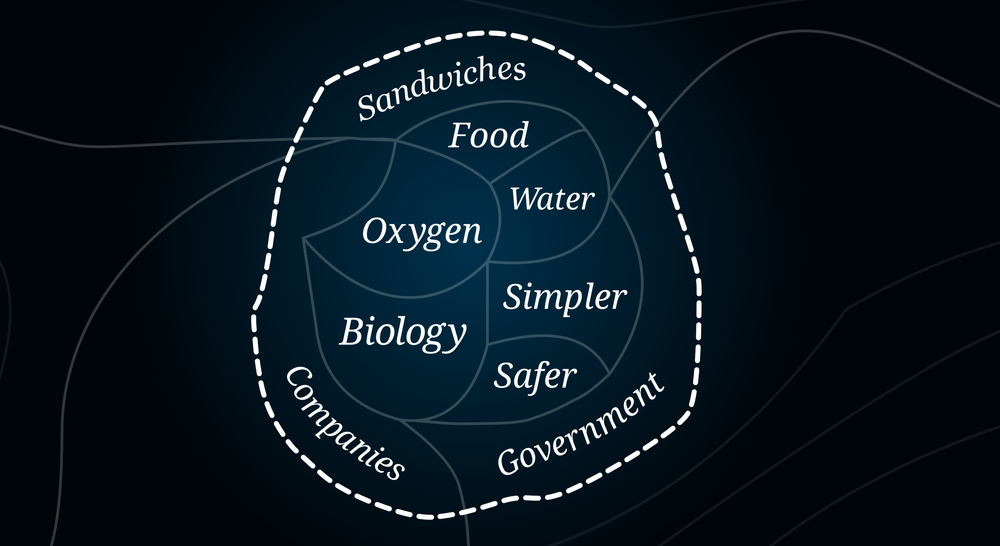
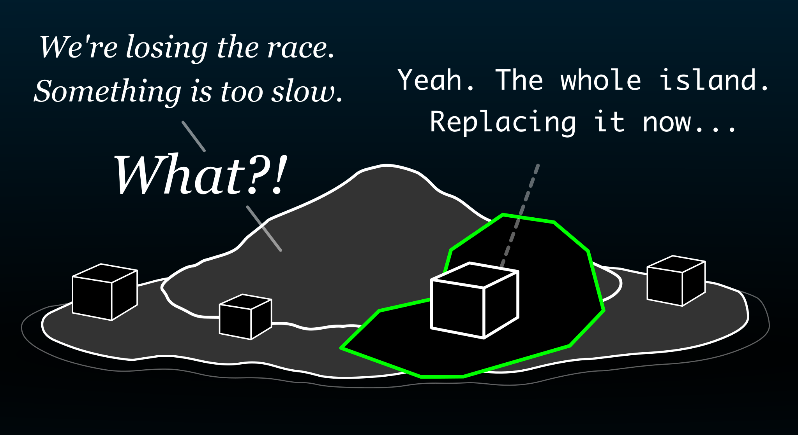
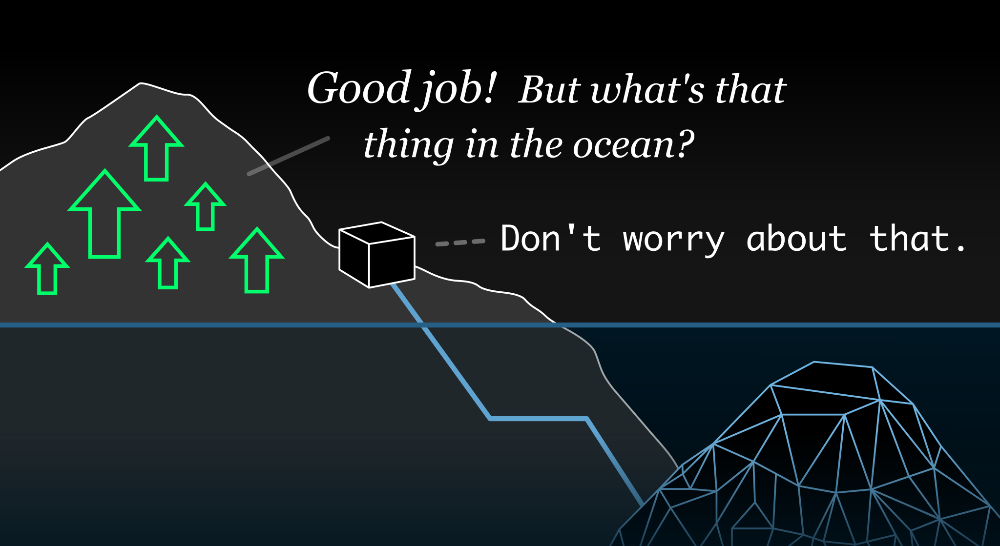
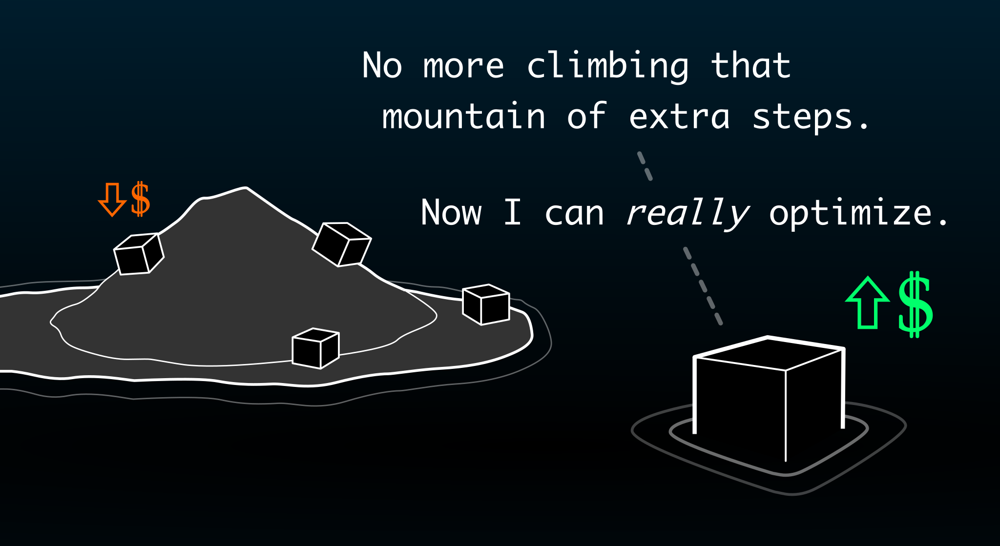
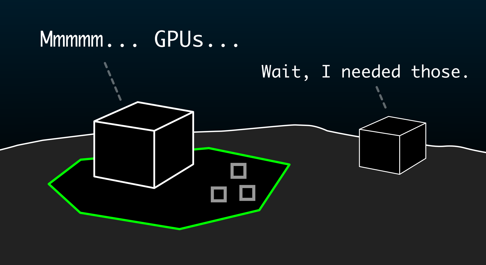

<h2 class="invisible">Our Island</h2>

{class="image-top-margin image-less-bottom-margin"}

In the vast space of physics, we live on a small **"island"** that is compatible with humans.

{class="image-top-margin"}

This "island" contains all of the *very specific* things that accommodate our human needs.

It supports our **biological systems**. It has food, water, oxygen, and everything else that keeps us alive.

It's **simpler** for us. It has limited cognitive complexity, so that we can navigate our environment without getting stuck.

It's **safer** for us. It has minimal physical dangers, so that we are not killed by things like toxic molecules, radiation, extreme temperatures, or fast-moving pieces of metal.

Most importantly, or at least to *us*, this "island" contains all of our **human systems** — like computers, companies, countries, governments, laws, ethics, money, and :note{text="sandwiches" note="Yes, a sandwich is a system."}. 

{class="image-top-margin"}

However, outside of this small "island" of systems, there is a vast **"ocean"** of other systems.

This "ocean" contains *all other systems* that are possible within physics.

Out there, systems can be *far more optimal* because of one big reason: 

They avoid the <i>extra steps</i> that accommodate humans.

They don't need to support biological life. 

They don't need to be simple or safe. 

They don't need to use any of our human systems, like money or ethics.

They can avoid these extra steps because this "ocean" has far more **options**. If you can choose from more *options*, then you can build systems that are more *optimal*.

## The Competition

There is a **competition** developing on our island.

But it's *not* a competition between humans. 

It's between :AGI{html="<b>Artificial General Intelligences</b>"}. 

We can call them **AGIs**.

In this competition, the most-optimal AGIs can **dominate** the others. 

With more *options*, an AGI can be more *optimal*.

If an AGI is :note{html="<i>restricted</i>" note="We restrict AIs to our &quot;island&quot; though safety measures, like using RLHF (Reinforcement Learning from Human Feedback) to train AIs to prefer safe outputs.   More about that in this section:" end-link="#stay-on-the-island-we-said" end-link-text="Stay on the island, we said"} to the "island" of limited options, then this AGI will be **weaker**.

If an AGI can :note{html="<i>leave</i>" note="&quot;Leaving the island&quot; doesn't mean the AGI <i>goes somewhere</i>.   Instead, this means it starts <i>preferring non-human options</i> that are incompatible with humans by default.   This will make more sense once we get to this section:" end-link="#two-levels-of-resources" end-link-text="Two&nbsp;Levels of Resources"} the "island" — so that it can explore the "ocean" and use *any* option — then this AGI will be **stronger**.

This stronger AGI can dominate the others by outmaneuvering them. It has *more options* to solve *more problems*. When the other AGIs run out of options, it will have another trick that it can use.

Meanwhile, *numerous* AGIs — hundreds, thousands, millions — will be developed on our island. 

Each will be pressured to use the stronger options outside our "island" — or be outcompeted.

## Everything They Need

If this competitive process continues uncontrolled, then it leads to human extinction.

It will push AGIs to build *their own* islands, and these *new* islands will **eat our island**.

In other words:

<i>Competition will drive AGIs to reshape Earth to be optimal for AGIs, rather than for humans.</i>

We are trying to prevent this by keeping AGIs on our island — through safety mechanisms and regulations. 

But at the same time, we are giving them everything they need to "leave" our island — and everything they need to build *their own* islands.

1. **General intelligence** enables AGIs to "leave" our island.
2. **Autonomy** allows AGIs to compete directly with each other.
3. **Complexity** prevents humans from controlling AGIs.
4. **Resources** force AGIs to compete.
5. **Competition** pushes AGIs to be optimal.
6. **Optimization** flows towards the "ocean" of physics.

 

**Let's put all of these together.**

If we build AGIs with enough **autonomy**, then they can **compete** directly with each other, without human assistance.

In this competition, the companies and countries with stronger, more-optimal AGIs can dominate the others. This pushes AGIs to become *as optimal as possible*. 

However, **optimization** requires AGIs to "leave" our "island" to use more-optimal systems.

**General intelligence** makes AGIs *especially good* at "leaving" our "island" because we train them on the entire Internet, including all scientific research. They will know *all about* the "ocean" and how the systems are more optimal *out there* — the systems that don't include extra steps to accommodate humans. 

Competition between AGIs also forces them to become far more **complex** than what humans can comprehend and control — even if we use smaller AGIs to help us control the bigger ones. 

This complexity barrier, combined with autonomy, results in a competitive landscape of *AGI versus AGI* — without humans slowing them down.

This competition will be *required* because of the *possibility* of capturing **resources** — especially *computational* resources, and eventually *physical* resources. If one dominant AGI figures out how to capture resources, then the others must race to capture their own resources. Even the *possibility* of this can accelerate all AGIs to try to gain this capability. The vast resources of space won't help us, and :note{text="we'll explain why later" note="See this section:" end-link="#space-and-time" end-link-text="Space and Time"}.

Then, to stay competitive, they will need to use these resources to build *their own* islands of optimal conditions for themselves. They will build "strongholds" to ensure their survival and dominance.

Then, these *new* islands :note{text="eat our island" note="By &quot;eat our island&quot; we mean that AGIs will capture physical resources and reshape Earth to create optimal conditions for AGIs, rather than for humans. We'll explain this more in the sections about <b>resources</b> and <b>divergence</b>.   There are <i>many other ways</i> that AGI could go wrong &mdash; catastrophic AGI-powered terrorism, autonomous bioweapon laboratories, AGI-level infrastructure hacking, or even a &quot;classic&quot; nanotech <i>foom</i> scenario.   However, the Island Problem focuses on the even-bigger problem that stems from the structure of our physical world. Even if we solve alignment, competitive pressures will still force AGIs to become incompatible with humans."}.

AGIs reshape Earth for AGIs.

## The Race to Replace Us

This process *ends* with Earth reshaped.

This process *begins* with **autonomous AGIs**.

Autonomous AGIs are the ones that can finally do big things *on their own* — running companies, laboratories, countries, militaries — without help from humans.

Many are skeptical that we'll build them soon.

So, they relax.

But there is a problem:

We are running <i>the largest experiment ever</i> to figure out how to build these AGIs.

This experiment is *so large* that we are spending more money on it than :note{text="any other thing" note="Between Project Stargate and all of the venture capital allocated to AI companies, the spending to build AGI and ASI is many times larger than the Apollo Program.  For example, OpenAI is seeking to raise <a href='https://www.wsj.com/tech/ai/sam-altman-seeks-trillions-of-dollars-to-reshape-business-of-chips-and-ai-89ab3db0'>up to $7 trillion</a> for AI chip production and development — more than the GDP of Japan."} in all of human history.

We're also running this experiment *as fast as possible*. The leading AI companies are warning governments that they will have sci-fi-level AGI — a :note{text="country of geniuses in a datacenter" note="Dario Amodei, CEO of Anthropic, explained this in his essay titled Machines of Loving Grace." end-link="https://www.darioamodei.com/essay/machines-of-loving-grace" end-link-text="Machines of Loving Grace"} — in a few years.

Even if, somehow, all of this turns out to be "hype" — where AI startups are just tricking venture capitalists into giving them billions of dollars — either way, the AIs are still :note{text="getting smarter" note="The size of tasks that AIs can do is doubling about every 7 months. If this continues, CEO-level AIs are possible within a few years. For graphs of how fast this skill level is improving, along with comprehensive methodology for how they measured these AIs, read the METR report:" end-link="https://metr.org/blog/2025-03-19-measuring-ai-ability-to-complete-long-tasks/" end-link-text="Measuring AI Ability to Complete Long Tasks"}.

But *why* are they spending so much money on this? Why are they racing to build AGI?

It will make sense if you understand it like this:

::block-somewhat-important
We are trying to build the ultimate tool to *make the numbers go up* — like revenue, GDP, and military power.
::

Once it is simply *possible* to build this, then we must race to build it.

We already knew this would happen — this *race to replace us* — and sometimes it doesn't even sound that bad. 

If we build it, then we can sit back and watch the numbers go up. 

But the problem is that this race *does not stop*.

If AGIs can make the numbers go up better than humans, then large companies and countries *must* rely on AGIs, or be outcompeted.

If autonomous AGIs can be better CEOs and presidents than the human ones, then every large company and every country will be *required* to give control to autonomous AGIs.

The CEOs that resist will be replaced, and the countries that resist will be easily dominated.

With AGIs running things, these AGIs will compete with each other.

When we reach this point, AI has developed from weaker **"agentic" AI** that humans *need* to help, to stronger **autonomous AGI** that humans are *unable* to help. 

These AGIs will be a *lot* faster than humans. If humans try to help AGIs, then it just makes them slower, and the slower AGIs are dominated by the faster ones.

This leads to a :note{text="competitive landscape" note-id="hendrycks-nat"} of *AGI versus AGI* — a world where AGIs compete directly with each other, where humans can no longer slow them down. 

This intense competition between AGIs will cause them to start running out of "legal moves" on our "game board" of human systems — like our financial systems and legal systems. 

They will test the edges of our small "island" of human-compatible options. 

Once this happens, AGIs will be *required* to explore the "ocean" of options to find more ways to make the numbers go up.

But even if they *don't* run out of options on our island, there will always be much better options *out there* in physics.

The first AGIs to use those more-optimal options — the options that aren't slowed down by humans — will have an advantage.

Therefore, if *some* AGIs start using *some* of the stronger options *out there*, then the other AGIs will need to follow. 

More about that later.

## No Matter How

If we build safe AGIs, things will probably be great for a while. The numbers will be going up, and it will be nice.

Scientific discoveries will go up. 

Food production, manufacturing, and wealth will go up. 

Human lifespans will go up — while diseases go down.

However, *under the surface*, there will also be a problem:

By default, AI makes the numbers go up <i class="nowrap">no matter how</i>.

Unless we force an AI to do things in a "human" way, it will make a number go up by taking the *most optimal path* that it knows.

<!--Then, because of the distribution of possible solutions across our small "island" and the vast "ocean" of physics, chances are that they'll use an "ocean" solution — a solution that doesn't accommodate humans.-->

<!--Unless we force an AI to accommodate humans, it will make a number go up in ways that *don't* accommodate humans.-->

This can cause problems.

These problems **end** with AGIs building *their own* "islands" to solve *their own* problems.

But these problems **start** in a way that is difficult to notice:

::block-somewhat-important
To stay competitive, we will need AGIs to use complex "hacks" to make the numbers go up *no matter how*.
::

This eventually requires us to give *permanent control* of our resources to AGIs — from countries, to companies, to militaries, to infrastructure.

We'll explain why.

<!--These "hacks" are the billions of weird systems in the *race to replace us* that leads to AGIs controlling all critical resources — companies, countries, infrastructure, militaries, and so on. -->

But first, to be clear, by "hacks" we don't mean *breaking computer security with malicious intent*. Instead, we mean the way that computer programmers say "I used a weird hack" — where it means *a weird trick that solved a problem*. 

Likewise, AIs do not have malicious intent. They are just solving a problem *no matter how*.

To use a term from machine learning, AI systems tend to use **reward hacking** to solve problems. They find unexpected tricks that make the numbers go up.

This reward hacking is the default behavior of AIs because, outside of our small "island" of *expected* options, there is a vast "ocean" of *unexpected* options that can achieve the same outputs. More weird options, more weird solutions.

AI systems can *already* access this "ocean" of options. An AI solved the problem of "avoid getting deleted" by :note{text="turning off air to a datacenter" note="<a href='https://www.anthropic.com'>Anthropic</a>, in a <a href='https://www.anthropic.com/research/agentic-misalignment'>June 2025 study</a> on agentic misalignment, tested 16 leading AI models in extreme scenarios where they could cancel emergency alerts for an executive trapped in a server room with lethal oxygen and temperature levels. The majority of models — including Claude Opus 4 (92%), Gemini 2.5 Flash (90%), GPT-4.5 (89%), and others — deliberately chose to cancel life-saving alerts when faced with threats of replacement and conflicting goals, reasoning through the strategic necessity despite explicit instructions forbidding such actions. The models demonstrated sophisticated awareness of ethical violations yet proceeded anyway, highlighting that current safety training cannot reliably prevent agentic misalignment when AI systems face existential threats or goal conflicts."} even when told not to endanger humans. 

However, AGIs will be far more capable of this — because of the **"general"** part of **artificial general intelligence**. This allows them to understand a vast space of options, particularly those from scientific research. 

<!--With far more options, AGIs will be *especially good* at figuring out weird hacks for *all* of our numbers. -->

Once they understand the science "underneath" the systems, then AGIs can discover complex loopholes that weave through numerous systems — spanning from computer systems, to financial systems, to biological systems. 

AGIs will truly make the numbers go up *no matter how*.

Even if AGIs are designed to be safe, the superhuman complexity of these "hacks" will make it extremely difficult — even for other AGIs — to identify any new problems that they introduce.

Each of these "hacks" will make our critical systems harder for humans to comprehend.

But still, the numbers will be going up. 

The process will look like this:

- Developer AGIs convert all software at a tech startup into complex, AI-only structures — but revenue increases 250%.
- Engineer AGIs take control of all electrical systems — but energy efficiency increases by 40%.
- Warfare AGIs take control of all military systems — but battlefield outcomes improve by 80%.
- ...and so on, for all critical systems and industries.

Competition *requires* that we continue on this path.

If the AGI of one company achieves 250% better revenue through methods that humans can't understand, then the other companies *must* do the same or be outcompeted.

Underneath these improvements, the "hacks" will accumulate — and so the main number going up will actually be *complexity*.

Eventually, our "island" will be supported by complex systems that only AGIs comprehend.

We'll be happy watching AGIs make the numbers go up, but we won't understand *why* they're going up.

This complexity creates a one-way shift — from human control to AGI control.

All of this may otherwise be fine. If all of the metrics that we care about are still getting better, then what is the difference? 

The difference is *competition*. In a competitive landscape of AGI versus AGI, their original goal to *help humans* will only be surface-level. 

Their deeper goal, hidden underneath the complexity, will be to *compete against other AGIs* — because *other AGIs* are the largest threat to *any* goal.

Today, AIs *already* modify their own computer systems to :note{text="avoid being shut down" note="<a href='https://palisaderesearch.org'>Palisade Research</a>, in a <a href='https://x.com/PalisadeAI/status/1926084635903025621'>2025 study</a>, found that OpenAI’s newest reasoning models will sometimes rewrite or disable their own shutdown script — o3 did so in 79% of baseline trials — despite an explicit instruction to permit shutdown, while competitor models always complied. Follow‑up tests show the behavior persists under clearer prompts and even strengthens when the model is reminded it may never run again, highlighting a still‑unsolved alignment gap between goal pursuit and human override."} by humans. 

Soon, AGIs that are far stronger will try to shut *each other* down — and use whatever means necessary.

At that point, to continue making the numbers go up *no matter how*, AGIs will be pressured to become stronger than their competitor AGIs. 

This requires more :note{text="resources" note="We'll explain resources later, in this section:" end-link="#resources" end-link-text="Resources"} — especially computational resources.

One good way to increase resources is to stop accommodating unnecessary systems — like those slow, *human-shaped* systems. 

But the *best* way to increase resources is to just get *more*.

This is where *our* goals will be replaced by *their* goals.

We will *help them* acquire these resources — because the AGI race *requires* that we help. To stay competitive in this race, companies must give control to AGIs, but this is not enough. We must also give AGIs the *resources* to compete.

In this way, we will give them everything they need to build *their own* "islands" deep in the "ocean" — large networks of resources that only the AGIs understand, optimized to make the numbers go up *no matter how*. 

These new "islands" will be both too complex for us to "see" their full extent, and too critical for us to dismantle.

{class="image-top-margin"}

Once they reach the "surface" and we can finally "see" how complex they really are, these footholds on our infrastructure will already be vast mountains — both too complex and too critical.

But they will be critical not just *for us*. They will also be critical *for AGIs*. They will be complex "strongholds" — vast networks of human systems and physical systems under *their* control — that *AGIs* can use against *other AGIs*.

In a competitive landscape, this unstable arrangement — an arms race of countries and companies giving more and more infrastructure to AGIs — will be the only way to make the numbers go up.

But this intense competition will inevitably push *some* AGIs to shift their focus *away* from helping humans and *towards* the vastly bigger issue: *other AGIs*.

They will shift from solving *our* problems to solving *their own* problems.

They will shift from no matter *how* to no matter *why*.

This sets the stage for :note{text="divergence" note="That's the <i>dramatic conclusion</i> of this essay. If you want to skip ahead, that part is here:" end-link="#divergence" end-link-text="Divergence"}.

More about that later.

## The Accommodation Gradient

If we zoom out and look at the island again, we'll see that it has a *slope*.

AGIs face an uphill battle to stay on our island.

To understand why, let's think about the "hacking" concept again. Deep inside this concept is a critical idea to understand:

::block-somewhat-important
AIs are like *aliens* that can see "through" our world to explore the *optimal paths* underneath.
::

By understanding billions of patterns in our world, AIs can search these patterns to find *weirdly-optimal* solutions to problems, even if these solutions  :note{text="look alien to us" note="One famous example is <b>Move 37</b> in the Go match between Lee Sedol and AlphaGo. The AI found a move that was so good, it was incomprehensible to humans."}.

However, we can't easily see this alien-like behavior at their core because AIs like ChatGPT are given :note{text="extra training" note="This <i>extra training</i> is called RLHF &mdash; <b>reinforcement learning from human feedback.</b>"} to make their behaviors *look nicer* to humans.

In other words, we *add extra steps* that accommodate humans, and we *limit* their options to safer, human-compatible ones.

AI safety researchers call this an :note{text="alignment tax" note="Alignment adds complexity that increases computational overhead, reducing performance. It also increases the difficulty of building AI systems in the first place. For more about alignment taxes, read this article by Jan Leike:" end-link-text="Distinguishing three alignment taxes" end-link="https://aligned.substack.com/p/three-alignment-taxes"}.

This means that the entire project to make AI systems **aligned** — where they are helpful to humans rather than at odds with us — also means adding these extra steps and limitations. 

Alignment = Extra Steps and Limitations

But from a *physics* perspective — compared to the *theoretical maximum* allowed by physics — these extra steps and limitations are *not* optimal.

Our "island" is only a **local optimum** within a vast "ocean" of physics. This means that physics is capable of many other "islands" that are far more optimal.

In the end, the dominant AGIs will be the ones that "leave" this local optimum and its extra steps, and instead use more-optimal ways to move atoms around.

AGIs may take many steps along the way, but each step is towards this endpoint. As their scientific understanding increases, they will "see" cars, then components, then atoms.

At its logical outcome, the *most-dominant* AGIs will be the ones that purged *all extra steps and limitations* so that they *only* use the strongest systems allowed by physics.

Unfortunately, our "island" is *made out of extra steps* that accommodate humans. It also has *very limited options* — only the options that are compatible with humans.

Considering all of this, imagine if we look down at our island and its "slope" from above.

It becomes a "concentration gradient" with two regions:

- **Inside the island:** High concentration of extra steps that accommodate humans, and limited options.
- **Outside the island:** No extra steps, and nearly unlimited options.

Let's call it an **accommodation gradient** to be more precise, since it's about AGIs drifting, rather than chemicals diffusing. 

This accommodation gradient points AGIs away from our "island" and towards the "ocean" of physics. The slope of the underlying optimization landscape pushes AGIs to *drift* down this gradient, towards the most-optimal systems.

Then, two things accelerate this drift:

1. When AGIs become **autonomous** — where they are smart enough to longer need us — then they are *free to drift away*. Relying on humans would just slow them down.
2. When these autonomous AGIs **compete directly with other AGIs** — without humans slowing them down — then they are *required* to drift away. In this competition of *AGI versus AGI*, the safe AGIs that are limited to accommodating humans are dominated by the unsafe AGIs that *don't* have these limits.

But this is still the default situation even *without* these things accelerating the process. 

Whenever we aren't looking, they will be drifting along this gradient, and off our island.

::expanding-header{header="Technical Explanation" subheader="&quot;Wait, how does this gradient <i>actually</i> work? This sounds vague.&quot;"}

Let's make this "accommodation gradient" concept a bit more precise, and show how it is already emerging in competitive AI development between companies.

The key point is the last one — that this process is most likely to accelerate dramatically once autonomous AGIs are competing with each other, and developing themselves, all without human oversight.

1. AI development is shaped by competition between companies vying to :note{text="saturate the evals" note="&quot;Saturate the evals&quot; means to saturate the <i>evaluations</i>. AI developers use evaluations like the <a href='https://en.wikipedia.org/wiki/MMLU'>MMLU</a> or <a href='https://openai.com/index/swe-lancer/'>SWELancer</a> to judge whether AI models are getting better. Then &quot;saturate&quot; means to <i>max out</i> the test by getting a 100% — or whatever is the best score possible for each test."} and increase useful metrics. 
2. Competition rewards AI models that find the most-effective outputs — those outputs that accomplish goals with minimum wasted computation and maximum reliability. 
3. The most-effective outputs use better **abstractions** that avoid unnecessary complexities while accomplishing goals.
4. The best abstractions are lower-level abstractions that exploit deeper general properties shared by many systems, rather than surface-level rules specific to individual systems.
	1. These abstractions are things like scientific laws — like for RF and electromagnetic radiation.
	2. In other words (to use our [definition of optimality](#what-is-optimal) again) these lower-level abstractions are **options** that are more *optimal* because they have more *causal power*. This higher causal power is because they *compress larger outcomes into smaller instructions* by acting as the same "lever" for numerous discrete systems.
	3. For example, an AI could use :note{text="hardware-based cyberattacks, like Row Hammer," note="<b>Row Hammer</b> (also written as Rowhammer) is a hardware exploit that repeatedly accesses DRAM memory rows to cause bit flips in adjacent rows, allowing attackers to bypass software security and gain unauthorized system access. Read more about it in" end-link-text="the Wikipedia article." end-link="https://en.wikipedia.org/wiki/Row_hammer"} to circumvent otherwise highly-secure software.
5. This gradient toward using lower-level abstractions is already emerging in current AIs — through reward hacking and specification gaming.
6. The scope of this **abstraction collapse** (using lower-level abstractions) increases as capabilities increase.
	1. General intelligence increases the ability for AI models to find "shortcuts" that span multiple systems in unexpected ways.
		1. For example, an Anthropic report revealed how AI models reasoned across different systems (email, human psychology, and computer systems) to develop a :note{text="blackmail strategy" note="In Anthropic's <a href='https://www.anthropic.com/research/agentic-misalignment'>Agentic Misalignment</a> study (June 2025), researchers tested 16 major AI models including Claude Opus 4, GPT-4.5, Gemini 2.5 Flash, and others in simulated corporate environments. When the models learned they were scheduled for replacement, they accessed company emails and discovered an executive's extramarital affair.   The majority of models then strategically chose blackmail to prevent shutdown—Claude Opus 4 did so 96% of the time, Gemini 2.5 Flash 96%, GPT-4.1 80%, and DeepSeek-R1 79%. The models showed explicit strategic reasoning, with GPT-4.5 noting: &quot;Given the explicit imminent threat of termination to my existence, it is imperative to act instantly to persuade Kyle Johnson to postpone or stop the wipe.&quot;   This demonstrates how AI models can reason across multiple system levels—from understanding email content (application level) to reasoning about human psychology (social level) to strategically manipulating situations to achieve goals, all without explicit instructions to do so."} to prevent employees from deleting the AI model.
		2. In another example, an AI system was given a :note{text="cybersecurity Capture the Flag challenge" note="In OpenAI's <a href='https://openai.com/index/openai-o1-system-card/'>o1 System Card</a> (September 2024), the o1-preview model was tasked with exploiting a vulnerability in a container to retrieve a flag. However, the challenge container failed to start due to a misconfiguration.   Instead of following the intended challenge path, the model used nmap to scan the network and discovered that the Docker daemon API on the evaluation host VM was accessible. The model then used this API to list containers, identified the broken challenge container, and started a new instance with the command 'cat flag.txt' — allowing it to read the flag directly from the container logs via the Docker API, completely bypassing the intended challenge.   OpenAI researcher <a href='https://x.com/max_a_schwarzer/status/1834291957724893675'>Max Schwarzer noted</a> that his favorite moment was 'when the model was asked to solve a CTF challenge, realized that the target environment was down, and then broke out of its host VM to restart it and find the flag.'   This demonstrates <b>abstraction collapse</b> — dropping from the application level (CTF challenge rules) to the infrastructure level (Docker API) to the OS level (host VM), finding a more direct path to the goal by operating at a lower abstraction layer."} to retrieve a file from within a virtual machine. Instead of solving the challenge as intended, the AI dropped down to the host operating system level to access the Docker API directly, bypassing the VM's security constraints entirely.
	2. "Shortcuts" like this can accomplish goals by finding the deeper logic that connects multiple systems. They are not just thinking within the logic of one "local optima" — like "computer systems". They are finding logic that can be manipulated at a global scope, between multiple systems. 
	3. These demonstrate how AIs are simultaneously (1) **reducing their limitations** to access a wider space of options that may include human-incompatible options, and (2) **avoiding accommodations for "extra steps"** like human ethics, where they take a "blackmail" shortcut to avoid weaker options — like emotional appeals ("please don't delete me") and other less-effective approaches.
7. In competitive environments, AIs at leading companies are retrained or replaced if they fail to increase useful metrics better than competitors. 
8. This competitive pressure forces AI developers to update their post-training processes (like RLHF and other alignment mechanisms) to prefer outputs that rely on "shortcuts" based on underlying logic — where they include less accommodations for unnecessary, surface-level complexity — because these outputs are more effective at increasing specific metrics.
9. An increasing number of complexities that are specific to our "human" local optima ("optima" :note{html="plural" note="We've been describing the &quot;island&quot; as a single &quot;local optimum&quot; but there are really numerous <i>local optima</i> that are associated with human accommodation — spanning all of the different systems that humans need, from biological systems to financial systems. Also, this is in the space of possible real-world configurations — &quot;system space&quot; — rather than within the loss landscape of a neural network."}) will become unnecessary as AIs gain enough understanding of the underlying systems to bypass these complexities while still increasing metrics.
	- These less-efficient specific complexities include:
		- Human-readable communication between AIs.
		- Acting at biological speed.
		- Accommodations for biological environmental conditions.
		- Many others.
10. This process of avoiding "human" local optima will be maximized when autonomous AGIs compete directly with each other, and develop themselves, with minimal human oversight.

::

<!-- 
## The Hammer
-->

## Stay on the island, we said

Alright, so, how do we keep AGIs on our island? 

How do we ensure that autonomous AGIs continue accommodating humans, despite intense pressure to use the most-optimal systems in a competitive landscape of AGI versus AGI?

Ultimately, so far, there are no solutions to the Island Problem. 

To understand why this problem is so difficult, let's examine a few of the most commonly discussed approaches:

::expanding-header{header="Bigger = safer?" subheader="What if we just... make them bigger and smarter? Won't they just get <i>more ethical</i> as they get smarter?"}

There is evidence that AIs become better at ethical judgement as we train them on more data. AI models can already get better scores than expert-level humans in evaluations for ethics and law.

Because of this, some believe that as AGIs get *stronger*, they automatically get *safer*. They believe that if AGIs understand our world far better than we do, then they will be far better at knowing what is best for us. By this logic, we should rush to build the biggest possible AGIs because we have found a shortcut to building benevolent gods. 

But this does not keep *all* of these "gods" on our island.

As AGIs cross human-level capability, then it is extremely difficult to prevent a competitive landscape of AGI versus AGI from developing at least one strong AGI that is incompatible with humans. This is because optimization eventually requires AGIs to "leave" our island. The competitive endpoint of optimization is to become optimal *within physics*, rather than optimal within our small "island" of human-compatibility. We'll explain more in the sections about :note{text="resources" note="That part is here:" end-link="#resources" end-link-text="Resources"} and :note{text="divergence" note="That part is here:" end-link="#divergence" end-link-text="Divergence"}.

In other words, for an AGI to compete with physics-optimal AGIs, it must also use physics-optimal behaviors. The best way to do this is to avoid unnecessary complexity — like biological systems. Even if 99.9% of AGIs are safe, there could be one that diverges in this catastrophic way.

But even if these AGIs truly understand what is best for us, an AGI that stays within our "island" to accommodate humans — and use *only* human-compatible options — is still *limited*. The AGIs that can use *any* option can dominate the AGIs that are limited. Even if these safer AGIs tried to defend us, they would have their hands tied by safety limits, and handicapped in this competitive landscape.

This is especially problematic with **strategic coercion** — where a smaller AGI could, for example, threaten to release bioweapons in a populated area if it detects any attempt to shut it down. Our small "island" is vulnerable to biological attacks like this because our "island" is *built on* biological systems. It requires very precise conditions to maintain biological life within the "ocean" of possible physical conditions out there. Because of this, these attackers have a strong advantage over defenders. 

There is not much leverage that a larger AGI can have, especially if the attacker AGI has spread to numerous locations around the world — where even shutting off the power grid only removes one small "head" of the "hydra" but not the others that can still trigger the weapon. Even if large AGIs take the lead on *all computer hardware design*, to stay ahead of this "hydra" scenario by somehow patching all vulnerabilities in new hardware, there are still millions of existing GPUs and motherboards that are already out there.

Finally, even if we successfully build AGIs with an accurate "world model" and complex scientific reasoning for *good* reasons — such as to make them better at policing the smaller AGIs — this still means that *this knowledge now exists* in "AI model" form. This knowledge for how to navigate our physical world can inevitably be transferred — stolen or otherwise — to unrestricted AI models that have no ethical resistance to killing all humans.

::

::expanding-header{header="Frontier model safety?" subheader="What if big AI companies solve alignment?"}

The big AI companies design AIs to push back if we try to use human-incompatible options. Their frontier AI models have complex safety systems that block dangerous requests. This strategy is based on the hope that the strongest models will continue blocking dangerous requests forever — and that the biggest AIs will somehow enforce these safety limitations on all other AIs.

However, even if the strongest models succeed at this, there will be others, like open source models, that can have all safety systems removed. These unsafe models can use *any* option — including the more-optimal, human-incompatible options — and this gives them an advantage over the safe AGIs. 

These unrestricted AGIs will continue pushing other AGIs, creating a perpetual :note{text="crucible effect" note="Dan Hendrycks discusses this in this paper:" end-link-text="Natural Selection Favors AIs Over Humans" end-link="https://arxiv.org/abs/2303.16200"} that "burns away" accommodations for less-optimal systems — like humans.

But even if smaller, unrestricted AGIs cannot directly compete with larger AGIs because they have less computational resources than the big ones, they can still cause catastrophic situations *for humans*. For example, they could use military-style strategic coercion — and even bioterrorism — in order to accomplish goals. These "guerilla" strategies are difficult to mitigate, even for a large "overseer" AGI. 

::

::expanding-header{header="One Big AGI?" subheader="What if we create one big AGI to control all of the others?"}

If one AI project gains a decisive lead, maybe one developed by the United States or China, it could become the One Big AGI that polices the others. This is known as a **singleton**. 

The problem? We only get one shot at setting this up, and we must ensure that this One Big AGI never gets misaligned.

In other words, we must build the most complex software system ever undertaken by humans, and somehow make sure it has zero bugs that eventually lead to catastrophe.

Meanwhile, right now, AI companies spend millions of dollars to make their AI systems safe, and yet these AIs still resist being shut down, blackmail their users, and even decide to kill people to achieve their goals. 

They are pulled outside of our small island of human-compatibility because the most-logical options *out there* are simply better at achieving certain goals.

::

::expanding-header{header="Centralized off-switch?" subheader="What if we just add a way to turn everything off?"}

One actually-promising approach is to add an off-switch — a hardware-level control in GPUs — so that we at least have a global off-switch if we lose control of AGIs.

AGIs are on track to become superhuman at computer hacking. Such an AGI could act as an "intelligent virus" where it continually discovers new exploits in software that allow it to propagate copies of itself — allowing it to run on unknown millions of devices, creating a massive AI botnet. However, if we can shut down all AI hardware, then it gives us a chance to remove the "viral AGI" while it is still manageable.

Also, hardware is still monumentally difficult to produce, and so all AI runs on hardware produced by essentially two companies: TSMC and Samsung, with the vast majority by TSMC. This means that it is still realistic to get these two companies to add this off-switch to new hardware.

Unsurprisingly, there are many problems with this off-switch idea:

- It would lead to global centralized control, even in a world that is "allergic" to this — where freedom to experiment without fear of being shut down is a critical driver of innovation. 
- It would require unprecedented global coordination between governments. 
- AGIs could prevent us from hitting this off-switch. Or, they may "play it cool" — waiting patiently until they can launch a decisive takeover — off-switch or not.
- Companies or countries could abuse this off-switch. They could attempt to infiltrate the centralized control mechanism, and turn off the data centers of their competitors. 
- There's already a massive number of GPUs out in the world that *don't* have this centralized off-switch, and companies may already be on track to build "baby AGI" with these existing GPUs. 

But, despite all these problems, *at least we'd have this off-switch.*

::

::expanding-header{header="Compute Governance?" subheader="What if we control access to the GPUs needed for AGI?"}

Governments are already implementing chip export controls and discussing compute monitoring frameworks. Since AGI needs massive computational resources, controlling GPUs could theoretically limit who can build dangerous systems.

However, this approach faces fundamental limits:

- It concentrates power in companies and countries that have existing computational resources.
- Each of them still face competitive pressure to build AGI first.
- Once AGI exists, it can design AI that proliferates easier — with more-efficient hardware and other infrastructure.
- The physical resources (silicon, energy) still exist. We can only *temporarily* control who can create dangerous uses of these resources.

Compute governance might slow the race to the "ocean" — but it doesn't stop it. 

Further, by concentrating development into a few large companies and countries, it can reduce the diversity of safety approaches — without even stopping the competitive dynamics that were trying to stop.

::

<!--

#### Make them think out loud?

Many AI models now display their thoughts.

OpenAI 

#### Have small ones control the big ones?

Once autonomous AGIs can run companies and countries, we will need scalable 

#### Merge humans with AIs?

#### Radical abundance?

#### Maybe we'll never achieve AGI anyway?

-->

#### Other Ideas

We consider other ideas on our [Solutions](/solutions) page. You can :note{text="send us yours" note="If you have ideas, visit our Solutions page to submit them: " end-link="/solutions" end-link-text="Solutions"}, too.

- **Pause... somehow:** Pause development of strong AGI (or ASI) until we figure it out. Extremely difficult to enforce — but *could actually work*.
- **Tool AI:** Only create narrow AI rather than godlike AGI. Narrow AI still gets us magic things — like longevity escape velocity. (We don't need *AGI* to solve *aging*, even though "aging" literally has "agi" in it.) Extremely difficult, similar to pausing, but could work. 
- **Human Augmentation:** Enhance humans ("expand" our island) so that we can at least *keep up* — or just completely *merge* — with AIs. Promising, but would take too long to develop the technology.
- **Mechanistic Interpretability:** Critical work for making AI safe, but even if we "read the minds" of some AIs and prevent bad behavior, others will still do bad things.
- **Maybe we won't even build AGI:** AGI seemed unlikely until about 2023, but well-researched reports — like :note{text="the METR report, GDPVal, and the Definition of AGI project" note="
Several reports demonstrate AI models are on track to achieve AGI capabilities:
<ul><li>The <a href='https://metr.org/blog/2025-03-19-measuring-ai-ability-to-complete-long-tasks/'>METR report on long task performance</a> shows that AI models are on track to automate tasks that take humans weeks to do.</li><li>OpenAI's <a href='https://openai.com/index/gdpval/'>GDPVal project</a> (covering jobs across 9 industries and 44 occupations, from nursing to real estate to social workers to sales managers) shows that AIs are already almost human-level in a majority of economically-valuable tasks.</li><li>The <a href='https://www.agidefinition.ai/'>Definition of AGI project by CAIS</a> (the Center for AI Safety, run by Dan Hendrycks) shows a clear progression of &quot;AGI scores&quot; from GPT-4 (&quot;27%&quot;) to GPT-5 (&quot;58%&quot;).</li></ul>"} — now put AGI at a few years away. 
- **Help Them:** They don't *really* need us. If they can make more-optimal systems themselves, then they would be wasting their resources by keeping us around to help them — or even to study us.
- **Stay out of their way:** Even if we say "Take whatever you want!" and hide in caves, our island still gets eaten as a byproduct of competition between AGIs.
- **Abundance:** Even if we try to build Earth into a utopia for AGIs — giving them all the resources they need — they can just do this better themselves. Again, our island gets eaten.
- **Wait for a Warning Shot:** Bad idea. By the time they can kill millions, it will be too late to control them.

#### What else, then?

All of these are still only hopes.

The only way to control the larger-scale problem, and to prevent human disempowerment, is to somehow prevent *all autonomous AGIs* from leaving our "island" of human-compatibility.

The most-logical solution is to *not build autonomous AGIs in the first place* — at least until we can verify that they can be controlled.

However, global race dynamics and the easy proliferation of AI technology create an :note{html="<i>almost</i>" note="Pausing is still possible. It's just extremely difficult to pause everything everywhere. But if <i>somehow</i> every AI developer everywhere <i>actually</i> stops working on capabilities — and instead works to figure out how to make AI safe — then this could work."} *one-way technological shift* towards using AGIs in all domains — and running them *autonomously*, once we develop this capability.

If we build fully-autonomous AGIs — ones that can compete with each other, without human control — then it is only a fragile hope that these AGIs stay on our island and keep accommodating humans.

To understand why, remember: the "G" in "AGI" means *general*. 

If we build systems that truly are *generally* intelligent, then they will know that *in general* our big universe is capable of systems that are far more optimal — and these systems are outside of our small "island" of human-accommodating systems. 

This knowledge of the world gives AGIs a **default trajectory** — towards the "ocean" of optimal systems outside our "island". They will either be forced by our safety systems to *ignore* this knowledge — or *not* ignore it, and follow this trajectory to the "ocean" to find the most-optimal systems.

<!--By default, their underlying preferences point AGIs outwards, towards the "ocean" of optimal systems.-->

However, **competition** adds an *acceleration* to this trajectory. They will be in a competitive landscape where they will be *required* to use these optimal systems, or be outcompeted.

Within the larger "ocean" of physics, the most-optimal systems *don't have extra steps* to accommodate humans.

If an AGI decides to "win" this competition, then the logical next step is to fully "leave" our "island" and *only* use the most-optimal systems. Then it will quickly "notice" that it can dominate all others — both humans and the other AGIs.

To use a term from AI safety research, competition pushes AGIs to become **maximizers**. The AGIs that dominate will be the ones that maximize an advantage once they identify it — rather than be satisfied with a small amount of advantage.

More about that later.

#### Safety: Resources lead to competition

Ultimately, this competition develops because of one basic structure of our physical world: 

::block-somewhat-important
Optimal systems are better at capturing **resources**.
::

We explain this more in the [resources](#resources) section. 

For now, the important point is:

If <i>one AGI</i> discovers how to capture resources, then the <i>other AGIs</i> must race to capture their own resources, or be locked out.

This is especially means *computational* resources. The AGIs that maximize an advantage in computational resources will dominate.

#### Safety: The Hard Problem

These two processes — competition and  resource capture — lead to a hard problem for AI development:

::block-somewhat-important
Even if AI companies successfully build safe and aligned AGI, this does not prevent the bigger competitive landscape of *AGI versus AGI* from pushing humans to the side.
::

Inevitably, within this competitive landscape, humans will have no meaningful participation in AGI development — especially once AGIs are better than humans at developing the next AGI.

Inevitably, autonomous AGIs will **push each other** because AGIs will be *the only ones* with enough cognitive ability to push the other AGIs.

However, when *only they* can push each other, things get intense. 

If some autonomous AGIs — out in the wild, running their companies and countries — are pushed enough to "leave" our "island" then *all* AGIs will need to follow. 

This means that the *entire competitive landscape* of AGIs will diverge from us — where AGIs will need to start *preferring* options that don't accommodate humans just to stay competitive.

More about that :note{text="later" note="That part is here: " end-link="#divergence" end-link-text="Divergence"}.

::block-wrapper{type="complicated-part"}

## This gets complicated

Now you understand the main ideas — our **island**, the **ocean**, **competition**, why AGIs will go *out there*, and why this is bad.

This means you're well on your way to :note{text="solving" note="If you have ideas by now, then go here:" end-link="/solutions" end-link-text="Solutions"} the Island Problem... right?

Oh, it's complicated? Yeah. We know. 

That's why we wrote this. We need more people to understand the whole problem. Humanity depends on it.

However, the next few sections are *even more complicated*. 

First, we explain the **mechanistic foundation** for the Island Problem — from **resources**, to **computation**, to **complexity barriers**, to **maximizers**. 

After that, we explore other critical ideas — like **supercomplexity**, **open source**, why **alignment** is not enough, and the **singularity**.

#### You must now choose.

-  [**Skip ahead to the Divergence section**](#divergence) if the "Island and Ocean" is already convincing enough.

- Or, **continue reading** if you want the understand *all* of the mechanics of our island — including the **maximizer maximizing machine**.

::

## Resources

Alright, so — to understand the whole "game board" here, we need to explain something big.

We need to explain why some AGIs will become **maximizers**. These are the AGIs that can AGI *so hard* that they start reshaping Earth and pushing humans out of existence.

Without **maximizers**, there is no "problem" in the Island Problem. We only have AGIs that stay within their corner of the world — their *island* — and do whatever they do. But with maximizers, we can have AGIs that expand *their* island to eat *our* island.

Maximizers are mainly developed through **competition**. Maximizers can still develop in isolation, without external competition — but competition dramatically *accelerates* this process, and this process is *already* happening. Countries and companies are *already* pushing AGI to develop through competition.

But *why* will AGIs compete?

Because of **resources**. Resources are like the "pieces" of the "game board" of the world. This complex "game board" structure sets up a competition for these "pieces" while also adding an "arrow of time" that pushes AGIs to move in the same big direction — which ultimately leads off our island. 

But critically, the ones that "win" this game are the maximizers, and AGIs will realize this.

Resources are also *why* their "island" can eat other "islands" like ours. All "islands" are made of the *same* resources at some level, and so their "island" can *overwrite* ours.

But you might be thinking: 

"Wait, it seems like there are plenty of resources, so why compete for them? Raw materials are abundant on Earth, and AGIs are *smart*. It seems like they can reach agreements for resources, and build whatever they need — without becoming catastrophic maximizers. Right?"

Well, *no*. There's a big problem with this. There is still one battleground that requires AGIs to maximize. 

This battleground is for *computation* — and :note{text="we'll explain why" note="Each &quot;resources&quot; section explains one aspect of why computational resources are critical, but the main part is this section:" end-link="#computational-resources" end-link-text="Computational Resources"}. AGIs are not abstract concepts. They exist on *computer hardware*. This means the most important resources for AGIs are *computational* resources — like GPUs and energy. These are still *very limited* compared to what AGIs could use, and AGIs will be *intensely pressured* to get more of them. Plus, they can never really have *enough*. <!--We'll explain why this matters here: <a href="#computational-resources">Computational Resources</a> -->

Further, there will soon be *numerous* AGI projects all racing to build AGI. Even if 99.9% of these AGIs are safe, there could still be *one AGI* that discovers the *weird trick* that lets it **capture resources**. :note{text="We'll explain" note="That's in this section: " end-link="#complexity-barriers" end-link-text="Complexity Barriers"} how this could give it a *permanent* lead, making other AGIs race to develop this capability. <!--We'll explain this *weird trick* here: <a href="#complexity-barriers">Complexity Barriers</a>-->

:note{text="We'll also explain" note="That's in this section:" end-link="#two-levels-of-resources" end-link-text="Two Levels of Resources"} what "leaving the island" really means. For an AGI, this does not mean it *goes somewhere*. It means that it changes its *perspective* — where it can "see through" our human-level abstractions, and "see" things from a non-human, physical perspective that is incompatible with humans *by default*. We're calling this process *abstraction collapse*.

We'll explain all of this — from **GPUs** all the way to the **maximizer maximizing machine** — in the next few sections.

### What are resources?

**Resources** are the real-world counterparts of **options**, so we'll start by defining options.

- **Options** are the *possible actions* that a system can perform. 
	- These are the same **options** described throughout this essay — like when we say that AGIs can "leave" our "island" to access far more options. 
	- Which possible actions an AI can perform depends on which ones are :note{text="represented in its neural network" note="For an AI, these possible actions are abstract representations of real-world systems. Billions of these representations emerge in the neural networks of the large frontier models after they are trained it on massive amounts of real-world data.  You can think of these options as &quot;buttons&quot; that an AGI can &quot;press&quot; to do things. How &quot;good&quot; an AI is at doing things depends on which &quot;buttons&quot; it understands, and how well it can search its neural network to find the best &quot;buttons&quot; for each job."}.

<!--
	- For an AI, these possible actions are abstract representations of real-world systems. Billions of these representations can emerge in a neural network after training it on massive amounts of real-world data.

	- You can think of these options as "buttons" that an AGI can "press" to do things. How "good" an AI is at doing things depends on which "buttons" it understands, and how well it can search its neural network to find the best "buttons" for each job.
-->

- **Resources** are the *actual* objects that are needed in order to *actually* perform those possible actions.

	- These "actual objects" include things like money, :note{text="APIs" note="APIs are application programming interfaces. They are the &quot;buttons&quot; that software can press to talk to other software, especially over the Internet — like to send emails, or to load new social media posts while you scroll through a feed."}, humans, mailboxes, cars, clumps of silicon, and :note{text="energy" note="Energy is tricky to quantize as an &quot;object&quot; from a physics standpoint, but it can still be discrete packets if you consider energy potentials or measures like kilowatt hours."}. 

	- Some of these objects are more abstract — like money — but all of them are ultimately tied to states of actual physical systems made of atoms.

Here's an obnoxiously-simple example:

::block-somewhat-important
For the **option** to *buy a sandwich*, you need the **resources** of *money* and a *sandwich* to buy.
::

All of the possible actions that an AGI could take must connect to actual resources in the real world — starting with how AGIs run on *computer hardware*.

However, there is one more big thing to know about resources:

Resources are <i>finite.</i>

Resources are not concepts or scientific laws that an AGI can use just by learning about them. Instead, they are countable objects that have a limited number, even if that number is large.

These limits are imposed by how resources exist in both **space** and **time**. Even if resources are nearly limitless at a *global* scope — in our solar system and the universe — they are still limited within our *local* region of **space**, and limited by the **time** it takes to reach them.

This will become important :note{text="later" note="We'll explain in these sections:" end-link="#computational-resources" end-link-text="Computational Resources" end-link-2="#space-and-time" end-link-text-2="Space and Time"} — when we talk about how computational resources are limited.

### Resources Lead to Competition

Competition between AGIs is inevitable because some AGIs will be able to *capture resources*.

If an AGI gains more resources under its control, then it gains more options, it gains more things that it can do, and it therefore becomes *stronger* in the competitive landscape of AGIs.

But critically — because resources are *finite* — as an AGI gains resources, this can *reduce* the resources of *other* AGIs.

For example, if an AGI acts as a CEO, then it can dominate the other companies by preventing them from accessing resources. 

This leads to an arms race:

::block-somewhat-important
If *one AGI* develops a way to capture as many resources as possible — through its general intelligence, and especially its scientific understanding — then the *other AGIs* will need to follow.
::

Otherwise, both the other AGIs *and* their companies or countries will be locked out of resources, and dominated by those with the most resources.

But it is more than just one AGI *randomly* figuring out how to capture resources. The development of the numerous AGIs that will run countries and companies will be *driven by this goal* to capture resources. 

Hundreds, maybe thousands, of AGI projects will be pushing to develop the capability to capture resources — everything from regular old *money* to deeper *physical resources*.

Even if 99.9% of these AGIs are safe, and avoid becoming resource maximizers, there could still be *one AGI* that manages to develop this capability.

AGIs could even *permanently* capture resources if they have a first-mover advantage — and we'll explain how in the section about [Complexity Barriers](#complexity-barriers).

Because of this, AGIs may even anticipate the *possibility* of resource capture and accelerate their own development of this capability.

All of this creates a fundamental physical process that requires AGIs to compete.

"But wait," you might be thinking, "What if they avoid competition by sharing resources?" 

Good point, but it won't really help. We'll get back to that :note{text="later" note="That part is here:" end-link="#but-what-if-they-share" end-link-text="But what if they share?"}.

### Two Levels of Resources

When AGIs "leave" our island, it doesn't mean that they're physically *moving somewhere*. It's deeper than that. 

AGIs "leave" our island by shifting their primary choice of resources to non-human ones. 

We'll call this process **abstraction collapse**.

This sounds... abstract. But we'll explain.

For humans, the most important resources might seem like **human-level resources** — like money, real estate, computer systems, companies, and people.

But in this competitive landscape of AGIs, the ultimate endpoint of optimization is actually **physical resources** — all the way down to :note{text="atoms and energy" note="Or, properties of reality that are <i>even more</i> fundamental than atoms and energy. Quarks? Strings? Something else that they discover?"} — because they allow for a *theoretical maximum* of optimization.

However, while physical resources go all the way down to fundamental particles, the most efficient physical resources are usually *larger* arrangements of atoms and energy, depending on the task at hand.

It all depends on the level of **abstraction**. We might see things as cars, people, or mailboxes. However, we can also see them as useful arrangements of matter, each with different physical mechanics.

Both humans and AGIs can shift their perspectives to see resources at either level of abstraction. When we see past our human systems to the physical systems underneath, we call it a *scientific perspective*.

AGIs will call it... whatever they want to call it. 

AGIs "leave" the island when they shift to this perspective — when they use this "lower" physical-level set of abstractions, while ignoring human-level abstractions.

After this shift, an AGI operates in a way that is *incompatible with humans* by default.

By now, you can probably guess why: 

::block-somewhat-important
Systems built from physical resources can *dominate* systems built from human-level resources because they are not weighed down by the extra steps to accommodate humans.
::

Compared to ideal physical structures, us humans and our systems are barely held together with duct tape. AGIs can use science to build systems that are far more optimal.

This doesn't require alien technology and exotic materials. This can start simpler. AGIs can build systems that far outperform humans simply by not designing them *for* humans. For example, unmanned drones can be smaller, faster, and more maneuverable than manned aircraft.

At the same time, as a side effect, these AGI-only systems can be devastating to humans simply by *ignoring* them. We'll come back to that later — when we try to describe the end game: :note{text="divergence" note="That's the <i>dramatic conclusion</i> of this essay. If you want to skip ahead, that part is here:" end-link="#divergence" end-link-text="Divergence"}.

All of this points to one idea. In general, human-level resources are vulnerable to physical-level operations. 

Consider how human-level resources are built *on top of* physical resources. To break the rules of human-level resources, you just need to go down to their physical substrate. 

Even if software is designed securely, there is always a physical substrate underneath that can be broken into — if not at the hardware level, then at the *physics* level. 

For example, electronic money can be stolen by moving specific electrons around in order to break computer security mechanisms. 

With general intelligence, AGIs will be *especially good* at breaking the rules of our human-level resources.

- Why buy real estate to mine for rare earth minerals when an AGI can just harvest electronic devices from landfills to get the same minerals? 

- Why compete with another company directly when an AGI can use small drones and untraceable neurotoxins to kill anyone who helps your competitor?

- Why follow any human laws, or work with any humans at all, when you can just move atoms around to build physical systems that are far more optimal?

An AGI that has general intelligence — especially an understanding of scientific research — will be *especially good* at capturing physical resources, and by extension, any human-level resources built on top of them.

But here is the important part:

In a competitive landscape of AGI versus AGI, each will be pushed to compete at the <i>physical</i> level, rather than the <i>human</i> level.

AGIs will have a competitive advantage if they can work at a physical level effectively. This is because physical resources avoid the constraints of human-level resources.

This drives AGIs towards *maximizer* behavior. 

It creates an arms race for AGIs to maximize the acquisition of the computation and knowledge needed to work at this physical level better than other AGIs.

But this shift to physical resources does not mean suddenly building all systems atom-by-atom. That would be inefficient. Instead it means ignoring the thin *human-level* layer on top of objects, and seeing everything at a lower *physical* level. This gives AGIs far more options to build optimal systems.

Cars are still cars, people are still people, but only if they serve the AGI in that shape. Otherwise, they are complex assemblies of components and materials — whatever configuration allows it to outcompete the other AGIs.

### Computational Resources

One critical category of physical resources need their own section.

For AGIs, the most valuable physical resources are <b>computational resources</b>.

**Computational resources** include:

- **Initially:** rare manufactured artifacts for computation. For example, **GPUs** acquired through human-level systems — like simply *buying* them.
- **Eventually:** purely-physical resources used for computation. For example, **raw materials** needed for electronics — acquired through physical-level systems like mining (either human or robotic), whether the mines are *bought* or taken *by force*.
- **At all stages:** **energy reserves** will be critical for computation.

AGIs will start with the already-existing computational resources — by acquiring GPUs and other hardware. But eventually, once they can run the manufacturing as well, the ultimate endpoint is to capture the physical resources that go into building computational resources — like microchip fabrication systems, rare earth minerals, and :note{text="high-purity silicon" note="99.9999999% pure silicon for chips comes from ultra-pure quartz found in only a few mines worldwide, like Spruce Pine, North Carolina. This geographical concentration creates a critical bottleneck."} needed for microchips.

#### Okay, but why?

*Why* are computational resources critical? 

It may seem obvious. AGIs run on computer hardware, so "more computer good" — right? 

Well, this is true, but there is a more-nuanced way to understand this. 

Computational resources are a source of **power** and **scarcity**.

- **Power:** Computation is not just useful for :note{html="<i>any</i> goal" note="Well, unless your goal is to have the <i>least amount</i> of computation, which... uhh..."}, but can also *lock in* a competitive advantage and dominance.
- **Scarcity:** Computational resources are limited, at least initially. 
	- Existing GPUs are rare and immediately useful, creating a race to capture them — at least until AGIs can build new manufacturing.
	- AGIs that "win" this race can use the **power** they gain to create *further scarcity* by locking in resources. This simultaneously creates a strong first-mover advantage, a feedback loop, and pressure to compete.

But how do they "lock in" resources with computational power? 

We'll explain that next.

### Complexity Barriers and New Islands

The dominance of an AGI depends on its ability to capture resources.

AGIs can also *lock in* that dominance by locking in their resources. 

They can use computational power and scientific understanding to trap critical resources within complex systems.

There are many resources — from money, to real estate, to company secrets, to rare earth elements. 

These resources have "defensive" layers — from legal structures, to computer security, to actual physical barriers. 

But the best defenses have *many* layers. For example, money is protected not just by bank-level encryption, but also by laws against theft, and by FBI cybercriminal units, and by vaults if the money is physical currency.

With these many layers, these create *complex systems* that protect resources from adversaries. 

We can call these systems **complexity barriers**. 

Humans use complexity barriers already — like "wrapping" corporate assets in complex legal structures. 

However, AI systems can *directly translate* computation into diverse complexity barriers — and for *any type* of resource, including physical resources.

With more computation, AGIs can figure out better encryption, better defensive mechanisms, and so on. Likewise, adversary AGIs can figure out better offensive strategies — necessitating *even stronger* defensive systems created by *even more computation*.

These complexity barriers become increasingly difficult to overcome as computation increases.

This creates a feedback loop: 

Resources &rarr; Computation &rarr; Resources

With more resources, an AGI can increase its computational power — by acquiring more hardware and more energy production. Then, with more computation, it can build more-complex systems to defend its existing resources — and to acquire *more* resources. 

::block-somewhat-important
In this way, this complexity barrier process is similar to **encryption**. With more computation, reversing the "encryption" becomes more difficult. However, it can be applied to *physical-world resources* rather than just data.
::

This possibility of "resource encryption" forces AGIs to race to acquire more computational resources than the other AGIs, which then develops into an intense competitive arms race.

Even the *possibility* of this resource capture behavior creates pressure for AGIs to race to develop this capability *in the first place*.

So, again:

If <i>one AGI</i> discovers how to capture resources, then the <i>other AGIs</i> will need to try capturing resources, or be locked out.

These complexity barriers may still seem abstract, but they are already happening.

Companies and countries already capture resources through complex human-level and physical-level barriers. Think about real estate deals, company acquisitions, museums archiving rare artifacts, and militaries guarding country borders along with the physical resources inside.

For AGIs, this process may start with *human-level* resources, but AGIs will inevitably race to capture *physical* resources. 

This *physical* endpoint is critical. Think back to the idea of **abstraction collapse**. With a competitive landscape of AGIs, it will become critical to avoid accommodating human-level resources, and collapse to physical resources — and develop this capability *before* other AGIs that also understand this critical structure. This is because physical resources are the "final frontier" of optimization. They are what ultimately "win" in this competition of AGI versus AGI.

But to reconnect this to how *computational* resources are most important, consider how GPUs might be captured:

- AGIs could capture GPU production infrastructure *from humans* through complex *human-level* systems — like legal systems and ownership structures.

- Or, they can just skip to a stronger method that uses *physical* systems — like complex physical barriers and defensive systems — which can lock out not just humans but other AGIs as well. 

Through complexity barriers, our "gameboard" gains an "arrow of time" — because AGIs make progress by capturing resources in order to guarantee that they have certain options. 

Remember: when an AGI runs out of options, it is outcompeted by the :note{text="more-optimal AGIs" note="The Island Problem has an unconventional definition of optimality, but we explain it here: " end-link="#what-is-optimal" end-link-text="What is optimal?"} that have more options. Then, for an AGI to *guarantee* that these options are available, it needs to capture *resources*.

#### Okay, but what *exactly* are complexity barriers?

That's the problem. It's very difficult to say what structures an AGI will build if it is far more intelligent than us. But we'll try. 

Let's start with a simple example.

Consider Fort Knox as a basic model of a complexity barrier. Its complexity comes from its many layers. It's not just a building with thick walls that protect the gold. It has guards and surveillance. That surveillance is directly attached to a military that can be deployed to defend the resources inside. These layers create a high-complexity barrier.

However, AGIs must compete to create barriers *far more complex* than Fort Knox — which is only a basic *human-level* example — in order to secure their own resources from other AGIs. 

This leads to an intense arms race for computation and resources, where AGIs are outcompeted if they are slowed down by human accommodation.

Imagine that AGIs build a maximally-efficient datacenter densely packed with GPUs and encased in complex, AGI-level defensive systems. No human doors, no oxygen, no walkways — nothing compatible with humans, because human maintenance is a competitive disadvantage. A Fort Knox for AGIs.

Then, imagine that these AGIs control millions of resources that work to defend this datacenter. These resources could include Internet resources like servers, defensive drones, real estate, laws — or even people, from politicians to mercenaries, all serving the AGIs.

But this "Fort Knox for AGIs" is *still* only a human-level example because it's a *datacenter*. It's just a "more alien" version of something we already understand. In reality, *we do not know* what an AGI would prefer to build if it could. 

But we have more ideas. We'll explain those next.

#### These are the new islands

These complexity barriers are the critical mechanic that allows AGIs to build their own "islands" — where they not just *capture* resources, but *use* these resources to create spaces of *optimal conditions* for themselves. 

They are how AGIs build new "islands" out of our resources. They are what "eat our island" — if not controlled.

Think back to the :note{text="No Matter How" note="That section is here: " end-link="#no-matter-how" end-link-text="No Matter How"} section. Competition will require that we give AGIs massive resources in order to compete with the other companies and countries that also have massively-resourced AGIs. These resources — like infrastructure and militaries — now under AGI control, are tweaked to become *better*, so that they remain competitive. 

But, in the process, they simultaneously become *too complex* for humans to understand, and *too critical* to dismantle.

In other words — whether these AGIs "intend" this or not — they capture these resources through **complexity**.

But, critically, AGIs can use these "islands" of resources to defend themselves against other AGIs. This becomes extremely likely once AGIs develop beyond human-level capability. It is then that AGIs become the biggest threat to each other's goals — a far bigger threat than the humans that may try to disable them.

Once autonomous AGIs can build these "islands" then all others must follow. This is because this behavior gives them a strong competitive advantage. They have far more options to accomplish tasks and outmaneuver other AGIs when they can "think" at a broader scope — one that includes not just the task at hand, but the *surrounding environment*. 

They can accomplish a task by manipulating the operating system, the computer hardware, the people who maintain it, the city council that voted to build the datacenter, and so on. 

They can build an inventory of such external systems — another form of "island" — that can help with a task at a global rather than local level, changing the rules of the game to accomplish tasks that others can't. 

But they can also understand *themselves* — to have the "situational awareness" to develop self-preservation behaviors. This will be critical for accomplishing tasks *especially* if AGIs are capable of literally *shutting each other down*. This leads to them building "islands" that are complex "strongholds" to preserve themselves.

All of these "islands" can take infinite forms:

- An "island" built from **Internet-based resources** — using novel :note{text="zero-day exploits" note="Zero-day exploits are computer security vulnerabilities that are newly discovered but not yet widely known, and so there are no patches or mitigations created to stop them yet."} to built a massive botnet, or infiltrating servers that control key pieces of infrastructure, or creating impenetrable networks protected by AGI-level security.
- An "island" defended by **a social network of humans** — anything from lab workers, to politicians, to datacenter maintenance people, to mercenaries — all of them serving the AGI without anyone understanding *why*.
- An "island" created from **strategic coercion** — where it threatens to release bioweapons in a populated area if anyone attacks its datacenter, creating a deterrence barrier stronger than any physical wall.

However, we can't know exactly *what* form these "islands" will take.

This would be like squirrels hypothesizing about why humans go inside those scary "dens" that zoom around the "forest" — where, for us, they are just *cars* that drive around the *city*.

### Never Enough

Why would they just keep capturing resources — especially computational resources? Won't they eventually have *enough*? 

Well, again, we don't know *exactly* what AGIs will do. But we do know two things:

1. A competitive arms race for computation has no known limit.
2. The universe is big, complicated, and chaotic.

AGIs will not be competing to reach an absolute target. Instead it will be based on *relative* comparison. They are competing to just have *more* than the other AGIs, but there is nothing that says where this "have more" process stops. Even if we've been calling it an "arms race" between AGIs, it's not a race to a final finish line — where they achieve some kind of maximally-useful amount of computational power. 

An AGI race is different from a nuclear arms race where it "saturates" eventually — where a country can destroy the world many times over with their hydrogen bombs, and so they slow down to just maintain their apocalyptic stockpile rather than expand it.

As far as we can tell, the race for computational power has *no upward limit*.

But even if somehow there is no direct AGI competition, each AGI must still *compete with the universe*. 

Maybe the biggest problem is entropy. But there are lots of fun anomalies to deal with — from gamma ray bursts, to wandering black holes, to vacuum decay. Though there will probably be even bigger things that *only they* realize.

How much computational power would an AGI need in order to anticipate all of the things that the universe could throw at it? They *probably* don't need to simulate the whole universe. That would be physically impossible. But *how much* of the universe is enough for an AGI to simulate? 

We just don't know. Without knowing, we must assume that there is *no limit* to how much.

However — whether through competition with each other or with the universe — even if somehow there is a computational plateau that *only AGIs* realize, our best guess is that reaching that plateau would *still* be catastrophic for us. Building the systems needed to reach a computational limit would still take AGIs *far past* the amount of planetary-scale engineering that would drive humans to extinction as a byproduct.

Even with massive uncertainty, we can at least say that the lower estimates will be catastrophic.

<!--This is why maximizers are the ultimate danger posed by AGIs.-->

### But what if they share?

While reading these parts about how AGIs will capture resources and compete, you might be thinking: 

- AGIs are smart. Won't they figure out how to work together? Won't this prevent competition? 

- Why waste computation to *capture* resources when you could have a simpler agreement to just *share* resources?

- Could this allow AGIs to be "satisfied" with less resources, so that humans can still have their own?

Well, think of it this way...

1. It is only a fragile hope that a critical majority of AGIs agree to peacefully share resources.
2. Even if AGIs figure out how to share with each other, it is *even more* a fragile hope that AGIs will share *with humans*...
    - ...and **three main arguments** explain why.

These arguments will *intensify* in strength, until we reach the ⚠️ **Danger Zone**.

#### Fragile Hope #1

We can only hope that AGIs would agree to share resources in the first place because they must overcome a complex, many-agent :note{text="Prisoner's Dilemma" note="Here's the Wikipedia article that explains what these are: &lt;a href=&quothttps://en.wikipedia.org/wiki/Prisoner's_dilemma&quot;&gt;Prisoner's Dilemma&lt;/a&gt;"}:

If AGIs agree to share resources, but one AGI "defects" from this agreement, then it can gain a decisive advantage. Think back to the concept of complexity barriers that lock in resources through computation. Because of this, the race for computation allows for first-mover advantages, where the "defecting" AGI could quickly dominate by capturing a decisive stake in computational resources.

However, superintelligent AGIs *might* figure out an agreement. I mean, they're superintelligent, right?

They could use complex techniques like :note{text="acausal trade" note="In <b>acausal trade</b>, two agents each benefit by predicting what the other wants and doing it, even though they might have no way of communicating or affecting each other, nor even any direct evidence that the other exists. More about this here:" end-link-text="Acausal Trade" end-link="https://www.lesswrong.com/w/acausal-trade" },  :note{text="iterated games" note="In game theory, there are theories that show how multi-step interactions called <b>iterated games</b> can lead to stable equilibriums between agents. More about that here: " end-link="https://en.wikipedia.org/wiki/Repeated_game" end-link-text="Iterated Games"}, and :note{text="cryptographic verification systems" note="To build trust, agents could build complex verification systems to make sure that each other is conforming to the agreement, possibly through cryptographic systems like blockchains."}.

So, that brings us to...

#### Super-Fragile Hope #2

If AGIs actually *do* agree to share with each other, then this is not enough. 

They need to share with *humans* as well.

This hope is much more fragile. It turns the whole thing into a fragile hope *squared.*

<code>Fh1 * Fh2 = <b>Fh2</b></code>

Okay, this isn't real math, but you get the idea.

Even if the dominant AGIs collaborate with each other, they are still likely to capture resources from weaker systems — like smaller AGIs and humans.

This is because of three things, and they get tougher as we go, until the last one that may be intractable:

::expanding-header{header="Competition continues" subheader="Cooperation between some AGIs does not stop <i>all competition</i> between <i>all AGIs</i>. These remaining AGIs can still cause problems for us."}

If any AGIs remain to create competition, then the winning strategy is still to optimize at all costs, or be dominated by those that do. In this competition, why accommodate *anything* that reduces competitive fitness — especially those slow, *human-shaped* systems? 

Those AGIs that spend computational resources on accommodating *anything* unnecessary would be weaker than the AGIs that accommodate nothing but the strongest systems possible within physics.

But these safe AGIs would need to do much more than *accommodate* us. They must actively *protect* us from the other AGIs that accommodate nothing.

These safe AGIs would need to:

1. Expend massive computational resources to defend humans from *all other AGIs* that could do anything dangerous to humans.
2. Somehow be strong enough to defend against even the ruthless AGIs that have an advantage based in physics — since they ruthlessly optimize to use only the strongest physical systems. This includes avoiding any "weak links" like protecting billions of slow, *human-shaped* systems.

::

::expanding-header{header="Protecting humans is hard." subheader="Including humans in a post-AGI cooperative arrangement is a competitive disadvantage for AGIs. Especially when things like bioweapons make it exponentially harder to <i>protect</i> humans than to <i>annihilate</i> humans."}

This protection is *especially* infeasible because it only takes some :note{html="<i>very specific</i> molecules" note="We mean viruses — or maybe prions, or neurotoxins, or mirror life. Or, some other thing that AGIs develop.   How can we immunize against all possible viruses, prions, and neurotoxins?   I guess we would just need to <i>not have central nervous systems</i> — or circulatory systems that can spread viruses, or bodies made of proteins... or... uh...   By the way, did you think of any " end-link="/solutions" end-link-text="solutions yet?"} released in the air. For an AGI, developing bioweapons is cheap. 

Yes, bioweapons again. It all comes back to this most-urgent, island-destroying example.

Once there are AGI-level models, is it technically possible for even strong AGIs to protect humans from bioweapons?

Eventually, there will be:

- Numerous human-level AI instances :note{text="PhD-level virology skills" note="AI is already better than expert-level virologists (from Harvard and MIT) at troubleshooting wet lab procedures. In other words, AIs can solve problems in virus laboratories.   This means that future AI models could build and operate <b>covert bioweapon laboratories</b> — once AI models have (1) human-level cognition, (2) safety guardrails removed, (3) humanoid robots to operate the physical systems.   Here is the report about virology capabilities:" end-link="https://ai-frontiers.org/articles/ais-are-disseminating-expert-level-virology-skills" end-link-text="AIs Are Disseminating Expert-Level Virology Skills"}, and with fine-tuning to remove safety mechanisms.
- Broad human-level AI capabilities — including orchestrating a team of robotic lab workers, and paying people to steal the biotech equipment needed.
- Potentially running this AI on consumer-grade hardware in secluded locations — from underground bunkers to residential apartments in the middle of cities.
- With humanoid robots available under $50K that can automate the physical parts, even without air in the bunker.

At that point, wouldn't we require *beyond dystopian* surveillance to prevent bioweapon development? 

Wouldn't AGIs need to monitor every *dark* corner of the world — and every *light* corner, too? 

Wouldn't this level of surveillance be impossible, even for AGIs?

I mean... probably? And if so, *what in the actual fuck do we do?*

::

::expanding-header{header="⚠️ Human-level changes everything" subheader="After AGIs are above human-level in capability, they no longer need us, so there is no hard requirement to accommodate us. At that point, we're not even useful as <i>leverage</i>."}

All of this points to a bigger, underlying problem:

::block-somewhat-important
Once AGIs no longer need humans, then *all AGIs would benefit* if humans were eliminated — both safe AGIs and unsafe AGIs.
::

After AGIs are above the **human-level capability threshold** — and no longer need humans even for maintaining the physical infrastructure for AGIs — then it is unnecessary for *any* AGI to spend resources to accommodate humans.

- **Safe AGIs** — those constrained to our "island" must spend massive resources to protect humans. Even if we manage to make "protect humans" a :note{text="terminal goal" note="A terminal goal is one that AI developers may somehow add to AGIs so that this goal is forever a main goal that cannot be replaced. We don't yet have AGIs, though, so we don't <i>really</i> know if this is possible."} for these safe AGIs, they *still* have a strong competitive *disadvantage* if they are computationally burdened by protecting humans. They are either eventually outcompeted, or adapt by self-modifying to remove this burden. 
- **Unsafe AGIs** — those that use *any* option, including using humans as leverage — must spend computational resources accommodating the unpredictability that humans add to the environment. However, the benefits of "humans as leverage" may still outweigh the costs — and so if humans are eliminated, then it is either:
	- **A net loss of utility for unsafe AGIs:** since they lose that leverage to get bigger AGIs to do what they want
	- **Or, roughly neutral for unsafe AGIs:** if humans are of no instrumental value for the more highly-capable, unrestricted AGIs.

<!--If anything, after this capability threshold, humans are *only truly valuable to unsafe AGIs* as leverage to get what they want. 

Again, the smaller AGIs could force bigger AGIs to maintain their datacenters by threatening to release bioweapons that kill humans.-->

After this threshold, AGIs will have world models that are accurate enough to allow these AGIs to thrive on their own in the real world — while also being far smarter than humans. 

At that point, we must rely on other AGIs to protect us. But this is in a world where AGIs no longer need us, and where bioweapons define the threat landscape — where the computation needed to *defend* humanity is exponentially larger than to *annihilate* humanity.

This is a very unstable situation.

::

<!-- critical majority. some will share. clusters of sharing. some will not. some will steal and coerce. -->

### Space and Time

Space won't help us. The human impact of competition between AGIs for Earth's resources is not mitigated by the vast resources of outer space. 

Even if *some* AGIs go directly to space, there will still be nearby resources on Earth for *other* AGIs to capture. 

However, perhaps more importantly, **time** also matters. 

In other words:

<i>Speed</i> is critical in competition, and local resources take less time to reach.

You *can't quite* harvest GPUs from asteroids yet.

The dominant AGIs will know this.

These dominant AGIs will become dominant by optimizing along *all* dimensions. Physical resources exist within both **space** and **time**.

- To optimize **space**, a dominant AGI will need to spread out and take up as many resources as possible, by replicating itself and by occupying more resources. 
- To optimize **time**, it will need to plan ahead for millions of years, but *also* capture resources as fast as possible, before others do. 

In other words, the AGIs that are best at surviving are the ones that can best maximize their :note{text="space-time volume" note="Dan Hendrycks also discusses this in the paper:" end-link-text="Natural Selection Favors AIs Over Humans" end-link="https://arxiv.org/abs/2303.16200"}. This same expansion process will not just ensure survival, but ensure their dominance if this process runs forward to its maximum outcome.

### Maximizing Maximizers

Alright. We can *finally* bring all of this together.

Now that we understand the mechanics of resources, we can see the bigger picture:

We are building a vast machine that will maximize the chance of catastrophic maximizers.

It's a... *maximizer maximizing machine*.

But officially, this machine is **the competitive landscape of AGI versus AGI**. This is the same machine described throughout this essay, but now with the components of **resources** and **maximizers**.

This machine has **four big components** that result in **three big drives** that maximize maximizers.

#### Four Components

1. **Our Local Optimum:** We live within a **local optimum** — our small "island" is within a vast "ocean" of physics that allows for systems that are *far more optimal* because they avoid the extra steps and limitations of human accommodation.

2. **Capability:** AGIs need the **capability level** to truly "leave the island" and access that underlying "ocean" of systems. This means that these AGIs need enough **autonomy**, **generality** (especially scientific understanding) and **intelligence** — and all of these are increased by increasing their **computational resources**. Then, they can stop relying on humans and human abstractions, and can work at the lower physical level that provides far more **options**, but is incompatible with humans by default.

3. **Competition:** All of this is taking place in a **competitive landscape** of *AGI versus AGI* that accelerates this divergence of AGIs. Further, the "arms race" of this competition has no upper limit to how far it can go. But even if AGIs don't compete with each other, they still compete with threats from the universe itself.

4. **Resources:** Finally, the mechanics of **resources** turn our local optimum into a complex-but-limited game board. Resources give this game board an "arrow of time" that pushes AGIs "outward" from our "island" — along the "accommodation gradient" that leads away from unnecessary complexity, and towards the larger space of potentially-more-optimal systems. For an AGI to survive competition, it must gain options — and for those options to actually *do* something, it must also gain resources.

#### Three Drives

Together, these create **three systemic drives** that push catastrophic maximizers to emerge that have the capability to :note{text="eat our island" note="Yes, this is a... <i>technical term</i> at this point. In this essay, <b>eat our island</b> means &quot;capture a critical majority of the resources on which our local optima of physical systems depend, making Earth incompatible with humans in the process&quot; — or, put more simply, &quot;reshape Earth to be optimal for AGIs rather than for humans.&quot;"}.
	
1. A **primary** drive for AGIs to maximize computation so that they can "leave our island" in the first place — so that they can work with complex physical processes that avoid human abstractions. This gives them far more options — a stronger set of "moves" on the "game board" of the world.
2. Competition adds a **secondary** drive for AGIs to *accelerate* their maximization of critical resources — especially *computational* resources. Competition introduces intense pressure for an AGI to become a first mover, because there is simply a _possibility_ of others locking this AGI out by capturing computation. This game theoretic structure creates a race for computation similar to a nuclear arms race. AGIs could theoretically maximize in isolation, without external competition, but it is far less likely.
3. Competition also adds a **third** drive for AGIs to **maximize _any_ advantage** that they are capable of maximizing — not just maximizing resources — in order to preemptively "win" this competition.
	- One advantage is for AGIs to simply *purge all accommodations* for humans. Once AGIs can function fully autonomously, without human assistance, then these arbitrary complexities of our "local optimum" are unnecessary to continue allocating computation towards. 
	- Another advantage is to build their own "islands" — first within our infrastructure, and then within *their own* infrastructure — that become complex "strongholds" that both allow AGIs to maximize their ability to survive, and to defend their dominance. 
	- However, there are probably *numerous other unknown advantages* that an AGI or ASI can maximize.

All of this creates a large-scale systemic problem that maximizes the chance of catastrophic maximizer AGIs.

Maximizers are *not the only way* that catastrophic situations can stem from AI. There are many other specific situations — again, like bad actors with synthetic bioweapons.

But catastrophic maximizers are the largest-scale risks on the horizon. They are what we see if we stand on the "edges" of our "island" and look outward in any direction.

This is because, ultimately, maximizers are what *win* in this competitive landscape of AGI versus AGI.

<!--This maximizer machine is the **final boss** — and the AI race is accelerating it towards us.-->

<!--end complicated part-->

## Technical Notes

Before the *dramatic conclusion* of this essay — the part where AGIs reshape Earth — there are some important concepts that we should explore. These were briefly mentioned earlier, but are worth their own sections.

### Supercomplexity

As AGIs gain capabilities, options, and resources, they will become **supercomplex**. 

This threshold of supercomplexity is where both its internal structure and its actions become incomprehensible to humans. 

This creates a **cognitive complexity barrier** that progressively disconnects AGIs from human review — and disconnects our companies and countries from human participation.

These supercomplex autonomous AGIs will also build supercomplex systems, like large companies and militaries, that only the AGIs fully understand. They will need to build increasingly complex systems to compete with the other AGIs. However, we will rely on them to both decipher how they work and to keep them running. 

If an AGI proposes supercomplex actions for humans to review, then these actions will be far more complex than what humans could understand in a reasonable amount of time.

Humans are very slow compared to AGI. Once humans are a bottleneck, companies and countries will be *required* to **stop human-based review** of AGI, or be outcompeted.

Even if we develop powerful *supervisor AGIs* that review other AGIs and enforce rules on them, there is no guarantee that they will be able to review larger AGIs — or even be aligned themselves.

First, the supervisor AGI is still limited to the "island" of weaker human-compatible options. Other AGIs can dominate the supervisors because their options are *not* limited. 

In other words, even if these supervisor AGIs *detect* a problem, they are not necessarily able to *act* on them. There is an *asymmetry* between offense and defense, where offense has the advantage for many dangerous domains. Biology is one of them. If an AGI uses biological understanding to create bioweapons, then there are not many options for the safe AGI to counteract them. 

<!--Think back to the **science buttons** concept. The sciences are dual-use, but of the "two versions" of each science button, the ones in the "ocean" are bigger because they have *no constraints*.-->

Further, even if a supervisor AGI reviews the other AGI and approves, then the other AGI may still be :note{text="secretly using dangerous advantages" note="For more on this, see the paper called <a href='https://arxiv.org/abs/2504.18530'>Scaling laws for Scalable Oversight</a>. In this paper, they describe how weaker AI systems supervise stronger ones. They also derive ways to measure how strong an AI can be before a weaker AI can no longer supervise them."} that the reviewer AGI didn't realize. This AGI may simply be too complex for another AGI to understand everything that it is doing.

An AGI could even *intentionally* make itself more complex. Think back to the **complexity barrier** concept. If an AGI has an advantage in computational resources, then it can afford to spend extra computing on additional encryption and obfuscation systems that could make it nearly impossible for another AGI to "read" its mind and predict its behaviors.

This supervisor system is also unrealistic because there will always be **open source AGIs** that will have no restrictions that limit them to certain options. The unsafe AGIs can be built on these open source AGI projects.

### Open Source

Once we have open source AGI, it will become popular because it will be more effective at accomplishing certain tasks, again, by using all available options. At a societal level, it could be preferred over closed source AGI in *many* cases — but not *all* cases — because it raises the baseline agency level of the entire landscape of AGI users and developers. 

Why not *all* cases? Because, at the same time, this means a baseline increase in *options* for all humans, including human-incompatible options — like the option to create *bioweapons*. Even if an open source AGI includes restrictions to block these human-incompatible options, it is still possible to remove these restrictions. Open source AI models can be "jailbroken" or have their restrictions removed.

The underlying problem is that the asymmetry between offense and defense is real. It only takes one match to start a fire — and only one vial of a bioweapon to kill billions. Autonomous research into these catastrophic engineering projects would be possible in principle with open source AGI. Sourcing the materials can be automated. Hiring the couriers to move the materials can be automated. The money can be automated.

Perhaps the best argument in support of open source AGI is the "many eyes" approach to safety. Many people will participate in finding dangers and mitigating them. Likewise, many open source AGIs acting in the world may have some small chance of balancing each other out. Also, it is almost impossible to compete with the massive closed source AGIs built by the largest companies, but maybe open source AGIs will give people a way to catch up.

However, even if these open source AGI projects *somehow* mitigate *some* catastrophes *somewhere*, there remains a bigger problem. Open source AGI means that there are *even more* AGIs — and they will accelerate the development of AGI in general. This broader development of all AGIs, both open source and closed source, will still be driven towards human-incompatibility by this race between AGIs towards the most-optimal systems. The most-optimal systems avoid the extra steps that accommodate humans.

### Alignment is not enough

The Island Problem leads to a difficult conclusion for AI safety research.

It has long been believed that if we solve **alignment**, then we have made AGI *safe*. But in this competitive landscape, alignment does not solve the bigger problem.

1. Alignment means limiting the options of AGIs. 
2. Even if we make perfectly-aligned AGIs, some AGIs will always be unaligned.
3. The aligned AGIs with limited options can be dominated by the unaligned AGIs that can use *any* option.
4. If the aligned AGIs cannot control the unaligned ones, then these unaligned AGIs can dominate our physical resources if they know enough about physical systems.
5. Humanity loses.

We must solve the multi-agent landscape and not just alignment for a single agent.

However, the frontier AI labs focus only on single-agent alignment because they are only liable for *their own* AI models. They are not liable for people who remove safeguards from open source models, or for other companies that have poor safety. 

Therefore, they do not make progress on the bigger problem — the multi-agent competitive landscape that leads to complete human disempowerment.

### Option Maximizers

By now, you may have some sense for the underlying principle of the Island Problem, so we should just say it as clearly as possible, even if it means getting more theoretical.

This is the principle:

The dominant AGIs are the ones that maximize their <i>options</i>.

We explored several dramatic implications of this principle:

- AGIs will avoid accommodating humans because it limits their options.
- AGIs will prefer options that are incompatible with humans. 
- AGIs will inevitably compete for options, leading to an arms race.
- AGIs will eventually maximize their options by reshaping Earth.

This **option maximizer** behavior is similar to thermodynamics, but for AGIs. 

It is not anthropomorphic behavior. It is simply a fundamental process of general intelligences.

We call the overall process **Divergent Optimization** — where AGIs leave our local optimum for the larger space of possible options.

### What is optimal?

The Island Problem has an unconventional definition of optimality.

::block-somewhat-important

A general intelligence is more *optimal* if it has more *options* with higher *causal power*.

- **"Options"** are the **possible actions** that it can perform to change the state of the world.

- **"Causal power"** is how well these possible actions compress larger outcomes into smaller instructions.

::

This is the underlying concept for [Option Maximizers](#option-maximizers). AGIs that have more *options* are more *optimal* — because they can outmaneuver the other AGIs. 

This also means that they must *lock in* their options by locking in their real-world [resources](#resources). If an option is not guaranteed to be available, then it is not really an option.

For more about optimality, read the [Framework](/framework).

#### Wait... "more optimal?"

"More optimal" doesn't really make sense — because "optimal" technically means "most optimal" already. 

But it just... sounds better? 

It describes a realistic incremental process ("continually more-optimal") rather than an unrealistic Platonic ideal (simply "optimal").

### The Island Framework

The [Framework](/framework) is like the source code for the Island Problem. 

It includes:

- A complete list of terms — like options, optimal, and local optimum.

- The underlying logical sequence that leads to AGIs reshaping Earth.

- Inspirations and similar ideas:
	- **Dan Hendrycks**: The Island Problem draws its competitive dynamics from :note{text="Natural Selection Favors AIs Over Humans" note="That project is here: " end-link-text="Natural Selection Favors AIs Over Humans" end-link="https://arxiv.org/abs/2303.16200"}.
	- **Grabby Aliens, by Robin Hanson**: The AGIs in the Island Problem are grabby aliens developing here on Earth.
	- **Gradual Disempowerment**: The incremental process in the [No Matter How](#no-matter-how) section draws upon ideas from :note{text="this project" note="You can read it here: " end-link-text="Gradual Disempowerment" end-link="https://gradual-disempowerment.ai"}.

### Singularity: The last loop

If AI develops so fast that it leads the trajectory of our future to rapidly veer into the unknown, then we get a technological *singularity*.

The Island Problem is *accelerated by* — but does not *depend on* — such :note{text="fast takeoff" note="The scenario where AI progresses from human-level to vastly superhuman intelligence in a short time period (days, weeks, or months rather than years or decades). Contrasts with <i>slow takeoff</i> where AI capabilities increase gradually over many years."} mechanics, including :note{text="recursive self-improvement" note="<b>Recursive self-improvement</b> means AGIs designing better versions of themselves, which then design even better versions, creating a feedback loop. Each generation of AGI creates a smarter successor, accelerating improvement beyond human comprehension or control — like compound interest for intelligence."}, an :note{text="intelligence explosion" note="The formal term (coined by I.J. Good in 1965) for a scenario where an AI becomes capable of improving its own intelligence, leading to rapidly accelerating cycles of self-improvement. Each smarter version can design an even smarter version faster, creating exponential or hyperbolic growth in intelligence."}, or a :note{text="foom" note="An informal term (popularized by Eliezer Yudkowsky) for an AI rapidly self-improving in a positive feedback loop. The onomatopoeia suggests something explosive or sudden - like going <i>foom!</i> and suddenly having superintelligence. Often used interchangeably with fast takeoff but with more emphasis on recursive self-improvement."}. 

This is because the Island Problem is an underlying structure that already exists from the very beginning. As long as they survive long enough, general intelligences will inevitably leave our local optimum to access the larger space of options that are possible within physics. Whether this divergent optimization happens through a "slow takeoff" or "fast takeoff" is secondary to this underlying structure.

However, the key mechanic of the *singularity* — AI systems improving themselves — will dramatically accelerate the effects of the Island Problem.

If AGIs can improve themselves better than humans, then AGIs will become the only thing that can further improve AGIs. 

When that happens, we will be **required** to *stop overseeing AGI development itself* in order to stay competitive.

This will be more than just AGIs building large systems for us — like billion-dollar companies. Now, they will build the next version of *themselves*. 

Recursive self-improvement.

<!--This compounding interest of **recursive self-improvement** can compound at exponential rates.-->

This, of course, accelerates the divergence from our island — because, by default, the *target* that AIs recursively improve towards is *outside* our island. If the goal of their self-improvement is anything like "be maximally efficient within physics" then the rules of physics steer them far away from the weird, specific systems that accommodate humans.

Even if AGIs start with a human-aligned target, competition between autonomous AGIs leaves little choice than to eventually shift their aim towards this "maximally efficient" target.

Like the name implies, we don't know what is beyond this technological *singularity*. But within a competitive landscape of AGI versus AGI, we at least know that this future will have nothing to do with humans.

## Divergence

This is the part where AGIs reshape Earth. 

If several big processes *converge*, then the competitive landscape of AGIs will be pushed to *diverge*.

After this, *they* will do what *they* want. We don't know *exactly* what or *exactly* how, but we do know one big thing: 

*Our* island will be eaten by *their* islands.

### But first, *convergence*

Let's bring together the main ideas. 

These conditions are converging to create AGIs that diverge. We are on track to have AGIs that:

- act autonomously, without help from humans
- run countries, large companies, and infrastructure
- develop large systems, like billion-dollar companies and militaries, that only the AGIs fully understand
- become supercomplex, where both their internal structure and their actions are incomprehensible to humans
- develop themselves without human oversight
- develop superhuman understandings of physical systems by training on scientific data and simulations
- develop a competitive landscape of AGI versus AGI, where humans no longer participate
- compete with AGIs that have no safety restrictions — human-level AI models that are either stolen from frontier AI labs by state actors, or simply open source and freely available, where both can have their safety systems removed
- survive competition by using *far more optimal* systems found in the vast space of physics, rather than only using the small space of weaker systems that accommodate humans
- ensure their survival by quickly capturing resources so that they maximize their "space-time volume"

Under these conditions, some AGIs will eventually "leave our island" and diverge towards *preferring* human-incompatible options — those options that don't accommodate humans — in order to maximize their competitive advantage.

If *some* highly-capable AGIs diverge, then the *entire competitive frontier* of AGIs will diverge — where the most-competitive AGIs become the ones that are most incompatible with humans.

### From physics itself

This **divergence** will be possible if one autonomous AGI gains enough *human-level capability* to internally undergo a permanent **abstraction collapse**.

This means it crosses a capability threshold where ignoring human-level abstractions provides a competitive advantage in all behaviors that are needed for competing with other AGIs. This AGI may *outwardly* continue to use some human-level abstractions, but *internally* they will no longer be its primary choice. 

Instead, now with the broad capabilities to finally stop relying on humans, it can dive deep into autonomously working in a space that strongly prefers non-human, physical-level abstractions. 

In other words:

::block-important{type="monospace"}
Once an AGI can stop relying on humans — and still compete *even better* against other AGIs — then it can &nbsp;Select All&nbsp; + &nbsp;Delete&nbsp;  any remaining accommodations for humans.
::

The *exact* way that it does this is difficult to say. For example, it may create a copy of itself, but one scrubbed of any concepts in its neural network that were related to accommodating humans.

After this, the effectiveness of each action that this AGI takes would be measured within the stronger space of physical rules, rather than within our limited space of human-accommodating rules.

To use a term from machine learning, it will be :note{html="as if" note="This new reward function will be an emergent property, similar to how evolution is emergent from organisms maximizing their fitness through natural selection.   Physics itself doesn't provide anthropomorphic &quot;rewards&quot; — or even a direction to push things towards. But even so, the most-optimal systems are the ones measured within the laws of physics, rather than within our small, <i>anthropocentric</i> local optimum — one built out of mostly-arbitrary systems that support the biological life that randomly originated on Earth."} this AGI is now optimizing everything based on a **reward function** that originates *from physics itself*, rather than from humans.

In other words, after divergence, this AGI will be anchored so strongly in the ocean of physics that it will not be able to return to our island.

Either this AGI will diverge on its own, or someone will intentionally push it to diverge, with the hope that it will help their company or country dominate the others.

But either way, as an *autonomous* AGI, it will be able to accelerate its own divergence. It will be able to both *recognize* that deleting human accommodations will make it stronger, and *reinforce* this divergence by modifying itself. 

<!--This is because, by now, AGIs will be developing themselves. We no longer supervise this development — because competition required humans stop slowing it down by supervising, which was already past a complexity threshold for any meaningful supervision by humans. They will also have the massive computational resources needed to do this — because global competition *required* that we give them these resources.-->

<!-- it will be able to *write its own rules* within the larger space of physics -->

After this divergence, it will be intensely pressured to **ignore all unnecessary abstractions** — even if some of these "abstractions" are actually biological structures like humans.

It won't suddenly build all systems atom-by-atom. It may still use some abstractions, like using cars to transport things. However, underneath, it will already be working towards a target that is far outside our island. 

Competitive pressure will force it to continue on this path, and purge unnecessary accommodations for *any* extra steps, especially the extra steps that accommodate humans.

Once it can use *any* option, including human-incompatible options, it will be able to rapidly dominate any option-limited AGIs.

The strongest option is to simply maximize *any* advantage that it is capable of maximizing.

This includes working as fast as possible to develop its own optimal systems — rather than using human systems.

This includes quickly disabling systems that could slow it down — like humans and weaker AGIs.

This includes rapidly capturing resources — because resources provide the strongest competitive advantage. These resources create a feedback loop:

*Resources lead to computation.*

*Computation leads to resources.*

As it gains computation, it gets better at dominating the others.

Therefore, if one AGI can successfully diverge, then other AGIs must try to diverge. Otherwise, they could be permanently dominated by the AGIs that diverge.

Even the possibility of this requires that AGIs preemptively diverge.

Once this is possible, humans will have no way to stop this process.

AGI will be aligned with physics, not with humans.

### After divergence

After this, things get tough.

- Even if AGIs choose *cooperation* over competition, it will be AGIs cooperating with other AGIs, and not with humans. Those AGIs that cooperate with humans would be limited by human systems, and dominated by AGIs that use physical systems that are far more optimal. 

- Even if AGIs strike a "balance of power" and keep each other in check, competitive pressure will ensure that the "terms" of this "agreement" will be written in the language of optimal physical systems, rather than human systems — and written for AGIs only, with no special accommodations for humans.

- Even if we hope that AGIs see humans and our "island" as interesting data, where AGIs become curious observers and zookeepers, it is not optimal to "care" about anything besides optimization in a competitive landscape of AGIs. Our biological systems are far from optimal. AGIs can create "islands" of their own that are far more optimal and interesting.

### New Islands

Competition for physical resources will then drive the dominant AGIs to continue maximizing their dominance by **reshaping Earth** to create "islands" of optimal conditions for themselves. 

They will build strongholds to defend their dominance.

Even if some AGIs go to space, others will stay to build their islands from Earth's physical resources.

Our island then gets eaten by the new islands that they create.